# Lab 1 - Accessing and Preparing Data

**Contents** 

<!-- TOC -->

- [Introduction](#introduction)
- [Power BI Desktop](#power-bi-desktop)
  - [Power BI Desktop – Accessing Data](#power-bi-desktop-accessing-data)
  - [Power BI Desktop – Data Preparation](#power-bi-desktop-data-preparation)
- [References](#references)

## Introduction

Today you will learn about various key features of the Power BI service. This is an introductory course intended to teach you how to author reports using Power BI Desktop, create operational dashboards,
and share content via the Power BI Service.

By the end of this lab, you will have learned:

- How to load data from Microsoft Excel and Comma-Separated Values (CSV) sources 
- How to manipulate the data to prepare it for reporting
- How to prepare the tables in Power Query and load them into the model

## Power BI Desktop

### Power BI Desktop – Accessing Data

In this section, you will import VanArsdel’s and its competitors’ USA sales data. You will then import and merge sales data from other countries.

### Power BI Desktop - Get Data

Let’s start by looking at the data files. The dataset contains sales data of VanArsdel and other competitors. We have seven years of transaction data by day, product, and zip code for each 
manufacturer. We are going to analyze data from seven countries.

USA sales data is in a CSV file located in the USSales subfolder within the Data folder (/Data/USSales).

Sales of all other countries is in the InternationalSales subfolder within the Data folder (/Data/InternationalSales). Each country’s sales data is in a CSV file in this folder.

Product, Geography, and Manufacturer information is in a Microsoft Excel file called bi_dimensions.xlsx in the USSales subfolder within the Data folder (/Data/USSales/).

1. Open the **bi_dimensions.xlsx file**. Notice that the first sheet has **Product** information. This sheet has a header, and product data is in a named table. Also notice that the **Category** column numerous
empty cells.

   The **Manufacturer sheet** has data laid out across the sheet, no column headers, several blank rows, and a note in row seven.

   The **Geo sheet** has the geography information. The first few rows have data details. Actual data starts on row four.
   
   
   
   We will start by connecting to data from these different sheets, and then perform data cleaning and transformation operations.
   
   
   
 2. If you don’t have the **Power BI Desktop** open, launch it now.
 
 3. Click **Already have a Power BI Account? Sign in** option.

 4. **Sign in** using your Power BI credentials.

 5. You will see the startup screen opens. Click on the **X** on the top right corner of the dialog box to close it.

 6. New format pane feature is released as part of the February 2022 update. This feature is in **Preview**. We will disable this feature for the labs. To disable it, navigate to **File -> Options and settings -> Options**. Options dialog opens. On the left panel select **Preview features** and **uncheck New Format pane**. Select **OK** to close the dialog. You may have to **restart** Power BI Desktop.

    Let’s set the **Locale** to US English to make it convenient in the rest of this lab.
 
 7. From the ribbon, click **File**, then click **Options and settings**, then click **Options**.
 
    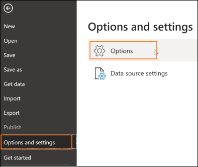
 
 8. In the left panel of **Options** dialog box, click **Regional Settings** under Current File.

 9. From the Locale drop-down, click **English (United States)**.

10. Click **OK** to close the dialog box.

    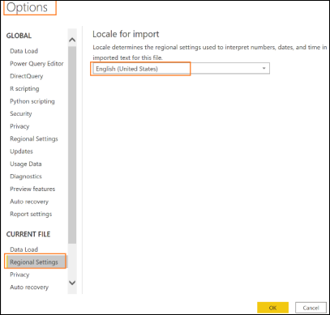
    
    The next step is to load data to Power BI Desktop. We will load USA Sales data which is in CSV files.
    
11. From the ribbon, click **Home** and then click the **Get Data** drop-down arrow.

12. Click **Text/CSV**.

    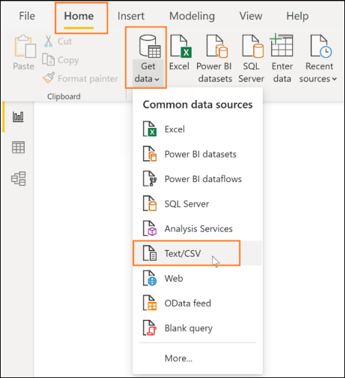
    
>**Note**: Power BI Desktop has the capability to connect to 300+ data sources. We are using CSV and Excel data files in this lab for simplicity. If you would like a full list of data sources, please visit this link: https://docs.microsoft.com/en-us/power-bi/connect-data/desktop-data-sources

13. Browse to **DIAD**, double-click **Data**, double-click the **USSales** folder, and then click **sales.csv**.

14. Click the **Open** button.

    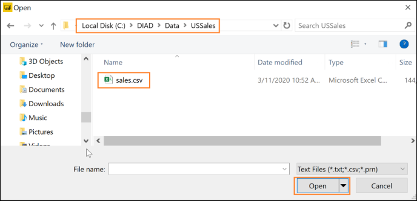
    
    Power BI detects the data type within each column. There are options to detect the data type based on the first 200 rows, based on the entire dataset or to not detect the data. Since our dataset is large and it will take time and resources to scan the complete dataset, we will leave the default option of selecting the dataset based on the first 200 rows.
    
    After completing your selection, you have three options – Load, Edit or Cancel.
    
      - **Load** adds the data from the source into Power BI Desktop for you to start creating reports.
      - **Transform** Data allows you to perform data shaping operations such as merging columns, adding additional columns, changing data types of columns as well as bringing in additional data. 
      - **Cancel** gets you back to the main canvas. 

 15. Click Transform Data as shown in the screenshot. A new window opens.

     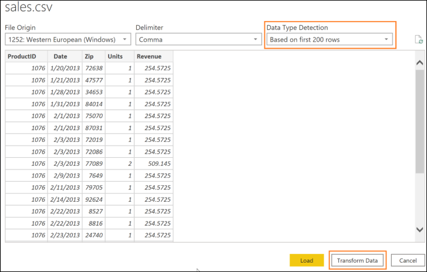
     
     You should be in the Query Editor window as shown in the screenshot below. The Query Editor is used to perform data shaping operations. Notice that the sales file you connected to shows as a query in the left panel. You can see a preview of the data in the center panel. Power BI predicts the data type of each field (based on the first 200 rows) as indicated next to the column header. In the right panel, steps that the Query Editor performs are recorded in the Applied Steps section.    
     
     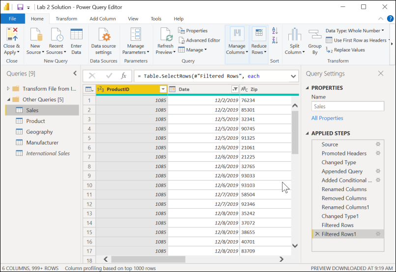
     
  >**Note**: You will bring in sales data from other countries as well as performing certain data shaping operations.

16. Notice that Power BI has set the **Zip** field to the data type **Whole Number**. To ensure that the leading zero is not dropped from Zip codes that start with zero, we will format them as **Text**. To do this, select the **Zip column**. Then, from the ribbon, click **Home**, click **Data Type**, and change it to **Text**.

17. The **Change Column Type** dialog box opens. Click the **Replace Current** button which overwrites Power BI’s predicted data type.

    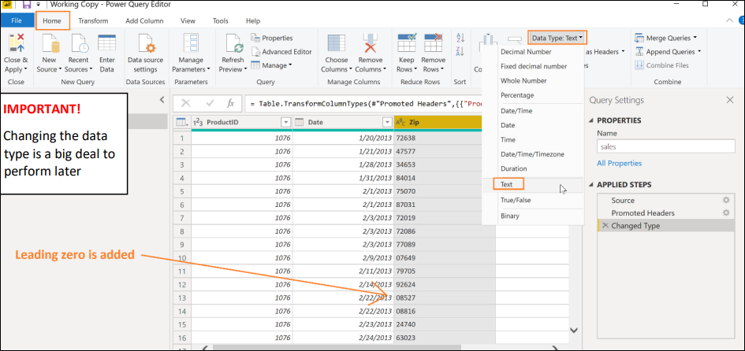
    
    Now let’s get the data that is in Excel source file.
    
18. From the ribbon, click **Home**, click **New Source**, and click then **Excel**.

    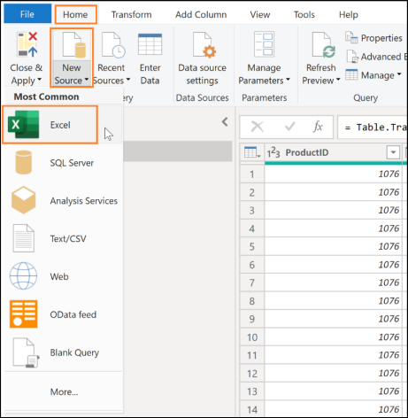
    
19. Browse to **DIAD**, double-click **Data**, double-click the **USSales** folder, and then click **bi_dimensions.xlsx**.

20. Click the **Open** button. The **Navigator** dialog box opens.

    
    
21. The **Navigator** dialog box lists three sheets that are in the Excel workbook. It also lists the **Product** table. Click **product** in the panel on the left. In the preview panel, notice that the first row is the headers. This is not part of the data.

22. Now, deselect **product** from the left panel and click **Product_Table**. Notice that this table has only the contents of the named table. This is the data we need.

    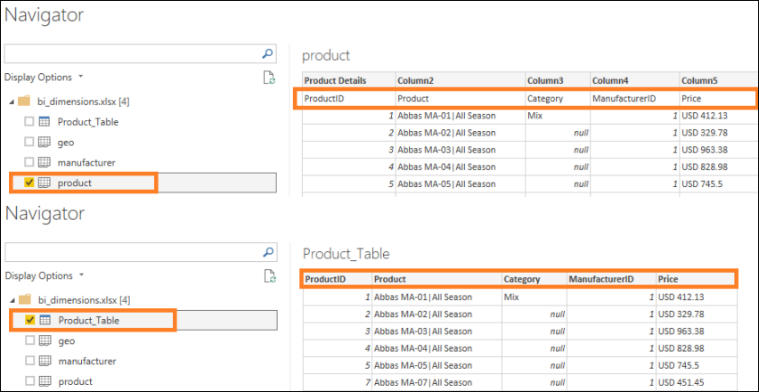
    
>**Note**: Table names are differentiated from Worksheet names by using different icons.
    
23. From the left panel, click **geo**. In the preview panel, notice that the first few rows are headers and are not part of the data. We will remove them shortly.

24. From the left panel, click **manufacturer**. In the preview panel, notice that the last couple of rows are footers and are not part of the data. We will remove them shortly.

25. Make sure that **Product_Table**, **geo** and **manufacturer** are selected in the left panel, and then click **OK**. Notice all that three sheets are added as queries in the Query Editor.

    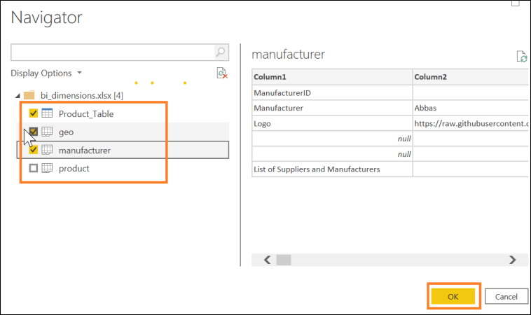

## Power BI Desktop - Adding additional data

In this scenario, the international subsidiaries have agreed to provide their sales data so that the company’s sales can be analyzed together. You’ve created a folder where they each put their data.

To analyze all the data together, you import the new data from each of the subsidiaries and combine it with the US Sales you loaded earlier.

You can load the files one at a time, like how you loaded the US Sales data, but Power BI provides an easier way to load all the files in a folder together.

26. On the **Home** tab of the Query Editor, click on the **New Source** drop-down menu.

27. Click **More…** as shown in the figure.

    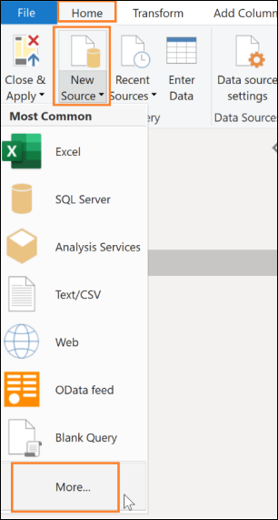
    
28. The Get Data dialog box opens.

29. In the **Get Data** dialog box, click **Folder** as shown in the diagram.

30. Click **Connect** and the **Folder** dialog box will open.

    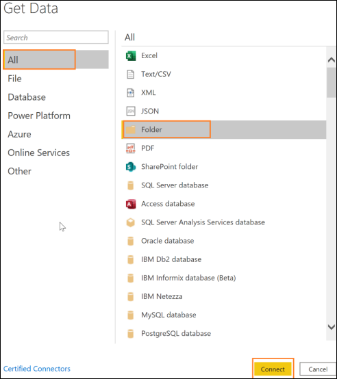
    
31. Click the **Browse…** button.

32. In the **Browse** for Folder dialog box, navigate to the location where you unzipped the class files.

33. Open the **DIAD** folder.

34. Open the **Data** folder.

35. Click the **InternationalSales** folder.

36. Click **OK** (to close the **Browse for Folder** dialog box).

37. Click **OK** (to close the **Folder** dialog box).

    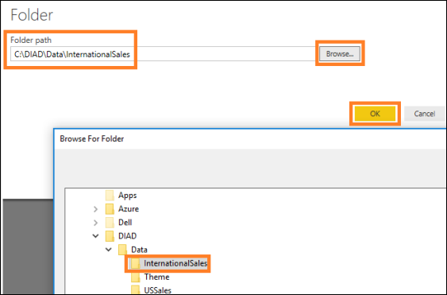
    
>**Note**: This approach will load all the files located in the folder. This is useful when you have a group that puts files on an FTP site each month and you are not always sure of the names of the files or the number of files. All the files must be of the same file type with columns in the same order.

The dialog box will display the list of files in the folder.

38. Click **Combine & Transform Data**.

    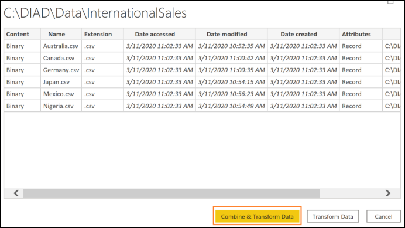
    
>**Note**: The data in your file for **Date accessed**, **Date modified**, and **Date created** might be different than the dates displayed in the screenshot. 

The **Combine Files** dialog box will open. By default, Power BI will again detect the data type based on the first 200 rows. Notice there is an option to select various file Delimiters. The file we are working with is Comma delimited, so let’s leave the Delimiter option as Comma.

There is also an option to select each individual file in the folder (using **Example File** drop-down) to validate the format of the files.

39. Click **OK**.

    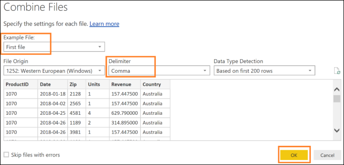

    You will now be in the **Query Editor** window with a new query named **InternationalSales**. 

40. If you do not see the **Queries** pane on left, click on the > (greater than) icon to expand. 

41. If you do not see the **Query Settings** pane on the right as shown in the figure, click on **View** in the ribbon and click **Query Settings** to see the pane. 

42. Click on the Query **InternationalSales**.

    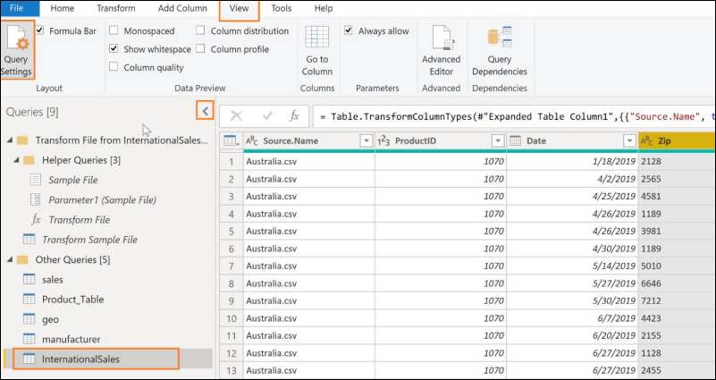
    
    Notice that column Zip is of the Whole Number type. Based on the first 200 rows, Power BI thinks theZip column consists of whole numbers. But zip code could be alpha numeric in some countries orregions or contain leading zeros. If we do not change the data type, we will receive an error when we load the data shortly. So, let’s change the Zip column to data type Text.
 
43. Highlight the **Zip** column and change the **Data Type** to **Text**.

44. The **Change Column Type** dialog box will open. Click the **Replace Current** button.

    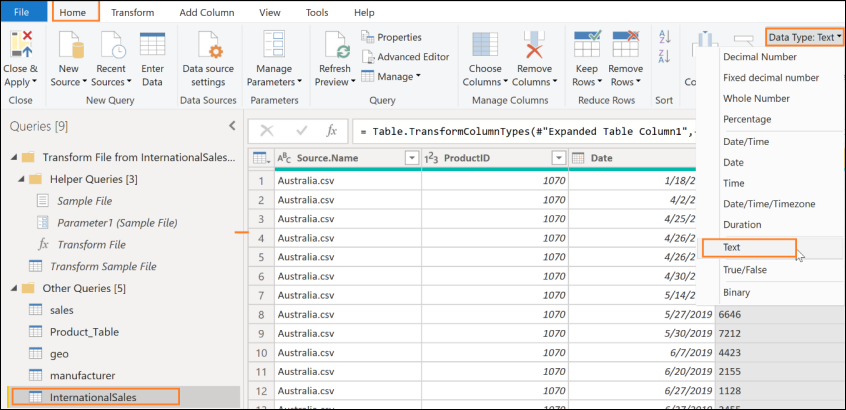
    
    In the Queries panel, notice that a Transform File from the InternationalSales folder is created. This contains the function used to load each of the files into the folder.

    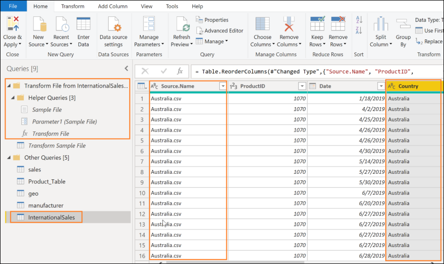
    
    If you compare the **InternationalSales** and the **sales** table, you will see the **InternationalSales** table contains two new columns, **Source.Name** and **Country**.

45. We do not need the **Source.Name** column. Click the **Source.Name** column and from the ribbon, click **Home**, click **Remove Columns**, and then click **Remove Columns** again.

    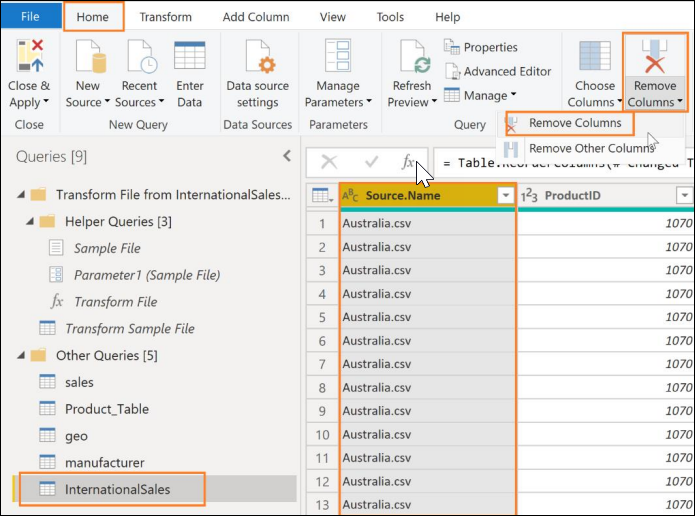
    
46. Next, click the drop-down menu next to the **Country** column to see the unique values. 

47. You will only see Australia as shown in the figure. By default, Power BI only loads the first 1000 rows. Click **Load more** to validate that you have data from the various countries included.

48. 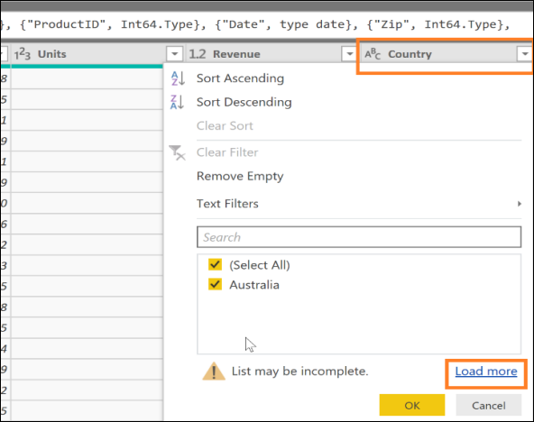

    You will see the countries (blank), Australia, Canada, Germany, Japan, Mexico, and Nigeria.

    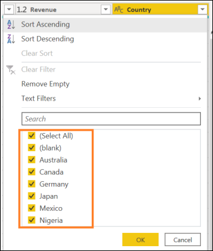
    
49. Click **OK**.

>**Note**: You can perform various types of filters, sorting operations using the drop-down to verify the imported data. 

## Power BI Desktop – Data Preparation

In this section, we will explore methods to [transform data in the data model](https://powerbi.microsoft.com/en-us/documentation/powerbi-desktop-shape-and-combine-data/). Transforming the data by renaming tables, updating data types, and appending tables together ensures that the data is ready to be used for reporting. In some instances, this means cleaning the data up so that similar sets of data can be combined. In other instances, groups of data are renamed so that they are more easilyrecognized by end users and report writing is simplified.

# Power BI Desktop - Renaming tables

The Query Editor window should appear as shown below.

 - If formula bar is disabled, you can turn on the formula bar from the **View** ribbon. This enables you to see the “M” code generated by each click on the ribbons.
 - Click the options available on the ribbon, **Home**, **Transform**, **Add Column**, and **View**, to review the various features available. 

1. Under the **Queries** panel, minimize the **Transform Files from InternationalSales** folder.

2. Click each query name in the **Other Queries** section.

   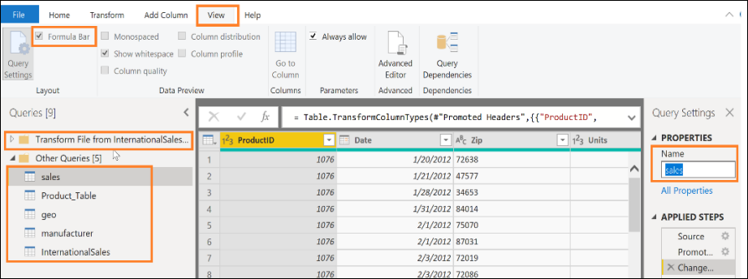
   
3. Navigate to **Query Settings**, and then the **Properties** section to rename the queries as shown below:

   | Initial Name             | Final Name            |
   | ------------------------ | --------------------- |
   | sales                    |  `Sales`              |
   | Product_Table            |  `Product`            |
   | geo                      | `Geography`           |
   | manufacturer             | `Manufacturer`        |
   | InternationalSales       | `International Sales` |

>**Note**: It is a best practice to provide descriptive query names and column names. These names are used in visuals and in the Q&A section, which is covered later in the lab.  
    
# Power BI Desktop – Filling empty values

In our scenario, some of the data is not in the right format. Power BI provides extensive transformation capabilities to clean and prepare data to meet your needs. Let’s start with the Product query.

Notice that the **Category** column has a lot of null values. Hover over the green/gray bar (known as the quality bar) below the column header. This allows you to easily identify errors and empty values in your data previews. It looks like there are values in the Category column only when the value changes. We need to provide data in this column so there are values in each row.

   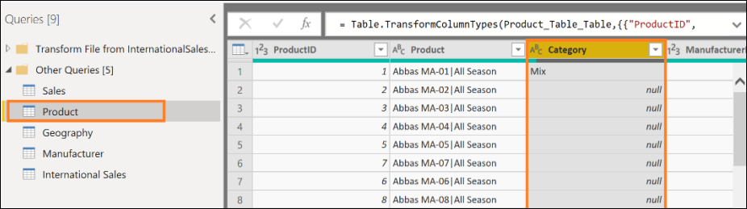

4. In the left panel, click the Product Query. 

5. Click the Category column.

6. From the ribbon, click Transform, click Fill, and then click Down.

   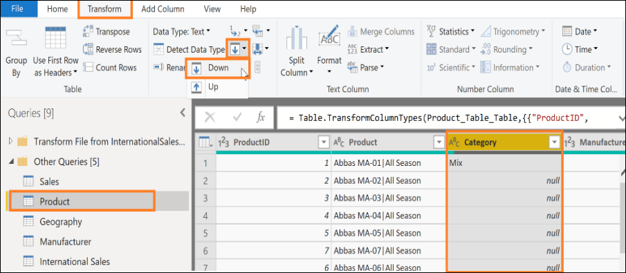

Notice how all the null values are filled with the appropriate Category values.

# Power BI Desktop – Splitting columns

In the Product query, notice the Product column. It looks like the product name and product segmentare concatenated into one field with a pipe (|) separator. Let’s split them into two columns. This will be useful when we build visuals, so we can analyze based on both fields.

7. From the left panel, click the **Product** Query. 

8. Click the **Product** column.

9. From the ribbon, click **Transform**, click **Split Column**, and then click **By Delimiter**. The Split **Column by Delimiter dialog** box opens.

10. In the dialog box, make sure that **Custom** is selected in the **Select or enter delimiter** drop-down menu.

>**Note**: The **Select or enter delimiter** drop-down menu has some of the standard delimiters like comma, colon, and so on.

11. Notice that in the text area, there is a hyphen (-). Power BI assumes we want to split by hyphen. Remove the hyphen symbol and enter the pipe symbol (|) as shown in the screenshot.

12. Click **OK**.

    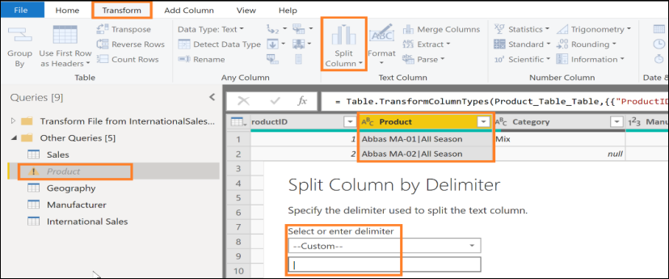
    
>**Note**: If the delimiter occurs multiple times, the **Split at** section provides the option to split only once (either left most or right most) or the option to split the column on each occurrence of the delimiter.

In this scenario, the delimiter occurs only once, therefore the Product column is split into two columns.

# Power BI Desktop – Renaming columns

Let’s rename the columns.

13. Click the **Product.1** column, and then **right-click** next to the column name.

14. Click **Rename…** from the selection menu.

15. **Rename** the field to **Product**.

16. Following these steps, also rename **Product.2** to **Segment**.

    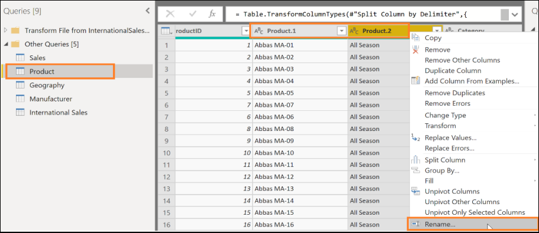
    
# Power BI Desktop – Using Column From Examples to split columns

In the Product query, notice that the Price column has price and currency concatenated into one field. To do any calculations we only need the numeric value. Therefore, we need to split this field into two columns. We can use the split feature like earlier or we can use **Column From Examples**. **Column From Examples** is handy in scenarios where the pattern is more complex than simply a delimiter.

17. From the left panel, click the **Product** Query.

18. From the ribbon, click **Add Column**, click **Column From Examples**, and then click **From All Columns**.

19. In the **first row of Column1**, enter the first Price value, **412.13**, and click enter. Notice after you click enter, Power BI knows that you want to split Price column. The formula Power BI uses is displayed as well.

20. **Double-click** the column header **Text After Delimiter** to rename it.

21. **Rename** the column to **MSRP**.

22. Click **OK** to apply the changes.
 
    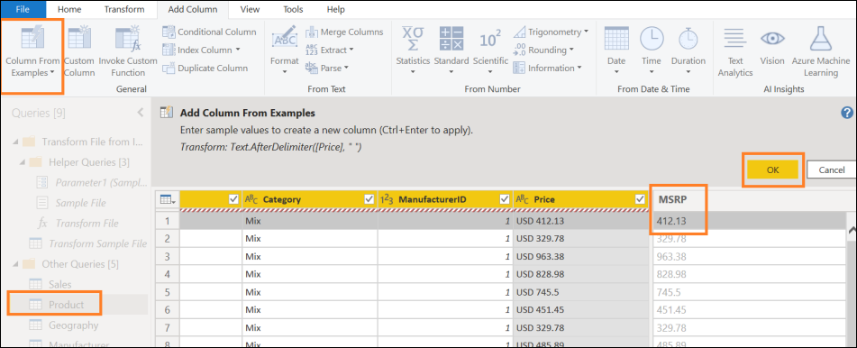
    
Notice that the **MSRP** field is of the data type text. It needs to be a decimal. Let’s change it.

23. Click **ABC** in the **MSRP** column.

24. From the menu, click **Fixed Decimal Number**.

    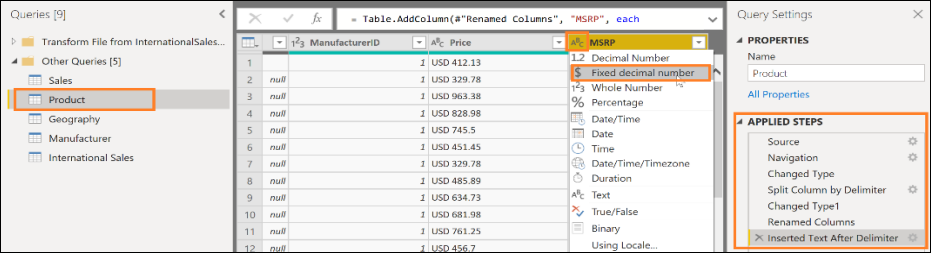
    
Notice that all the steps we performed on the Product query are being recorded under **APPLIED STEPS** in the right panel. 

Now let’s create a currency column in the same way.

25. With the Product query selected, from the ribbon, click **Add Column**, click **Column From Examples**, and then click **From All Columns**.

26. In the first row of Column1 enter the first **Currency** value as USD and then click enter.

    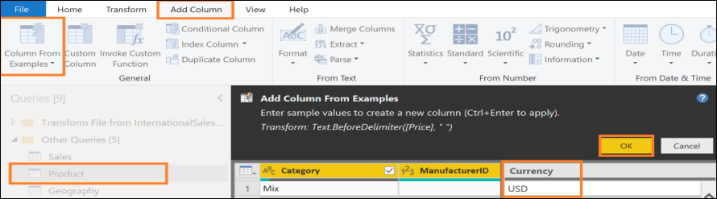
    
Notice that after you click enter, Power BI knows you want to split the Price column. The formula it uses is displayed as well.

27. **Double click** the column header **Text Before Delimiter** to rename it.

28. **Rename** the column to **Currency**.

29. Click **OK** to apply the changes.

Now that we have split Price column into the MSRP and Currency columns, we don’t need the Pricecolumn. Let’s remove it.

30. From the left panel, click the **Product** Query. 

31. **Right-click** on the **Price** column.

32. Click **Remove**.

    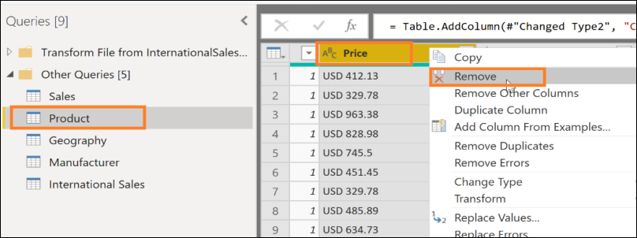
    
# Power BI Desktop – Removing unwanted rows

In the **Geography** query, notice that the first two rows are informational. They are not part of the data. Similarly, in the Manufacturer query, the last couple of rows are not part of the data. Let’s remove them so we have a clean dataset.

33. In the left panel, click the **Geography** query.

34. From the ribbon, click **Home**, click **Remove Rows**, and then click **Remove Top Rows**.

35. The **Remove Top Rows** dialog box opens. Enter **2** in the text box since we want to remove the top informational data row and the blank second row.

36. Click **OK**.

    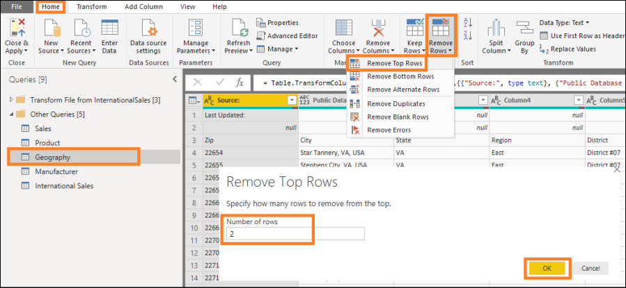
    
Notice the first row in the Geography query is now the column header. Let’s make it a header.

37. With **Geography** query selected in the left panel, from the ribbon click **Home**, and then click **Use First Row as Headers**.

With that step, Power BI will predict the data type of each field again.

Notice that the column **Zip** was changed to the number data type. Let’s change it to text as we did earlier. If we don’t, we will see errors when we load the data.

38. Click **123** next to the Zip Column. From the dialog box, click **Text**.

39. Click **Replace Current** in the **Change Column Type** dialog box.

    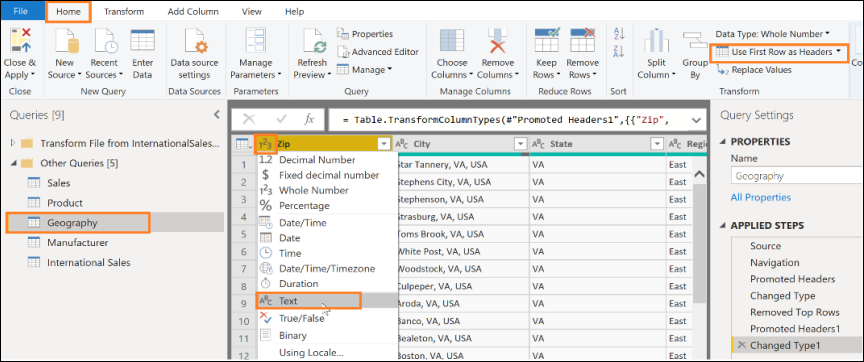

40. From the left panel, click the **Manufacturer** query. Notice the bottom three rows are not part of the data. Let’s remove them.

41. From the ribbon, click **Home**, click **Remove Rows**, and then click **Remove Bottom Rows**.

42. The **Remove Bottom Rows** dialog box opens. Enter **3** in the **Number of rows text box**.

43. Click **OK**.

    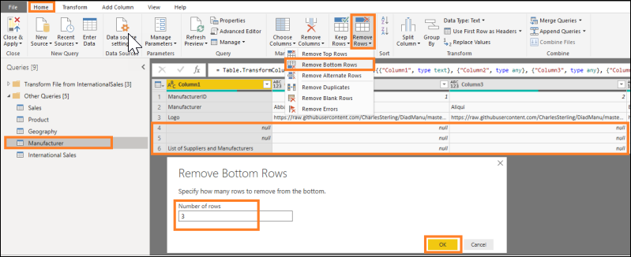

# Power BI Desktop – Transposing data

44. From the left panel, click the **Manufacturer** Query. Notice that the **ManufacturerID**, **Manufacturer**, and **Logo** data is laid across in rows. Also notice that the header is not useful. We need to transpose the table to meet our needs.

45. From the ribbon click **Transform** and then click **Transpose**.

    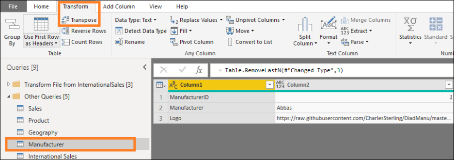
    
Notice that this transposes the data into columns. Now we need the first row to be the header.

46. From the ribbon click **Home** and then click **Use First Row as Headers**.

    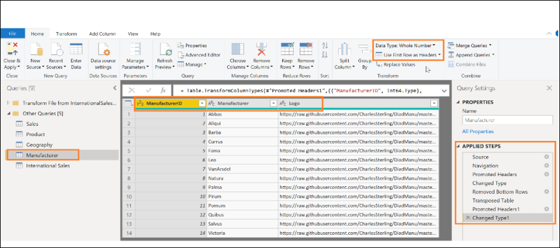

Notice that now the **Manufacturer** table is laid out the way we need it with a header and values along columns.

Also notice that on the right panel under **APPLIED STEPS** you will see the list of transformations and steps that have been applied. You can navigate through each change made to the data by clicking on the step. Steps can also be deleted by clicking on the **X** that appears to the left of the step. The properties of each step can be reviewed by clicking on the **gear** to the right of the step. 

# Power BI Desktop – Appending queries

To analyze the Sales of all countries, it is convenient to have a single **Sales** table. To do this, you need to append all the rows from the **International Sales** query to the **Sales** query.

47. Click **Sales** in the Queries window in the left panel as shown above.

48. From the ribbon click **Home** and then click **Append Queries**. 

    The **Append** dialog box opens. There is an option to append **Two tables** or **Three or more tables**. 
    
    Leave **Two tables** selected since we are appending just two tables.

49. Click **International Sales** from the drop-down and then click **OK**.

    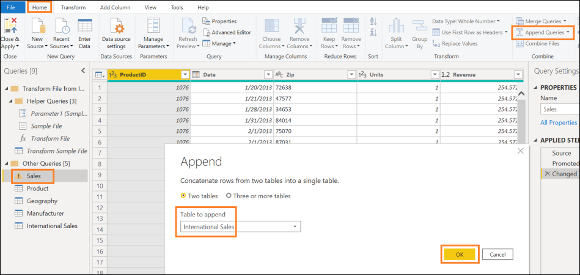
    
You will now see a new column in the **Sales** table called **Country**. Since the International **Sales** query had the additional column for **Country**, Power BI Desktop added the column to the **Sales** table when it loaded the values from the **International Sales** query.

You will see **null values** in the **Country** column by default for the **Sales** table rows because that column did not exist for the table with USA data. We will now add the value “**USA**” as a data shaping operation. 

50. From the ribbon click **Add Column** and then click **Conditional Column**.

    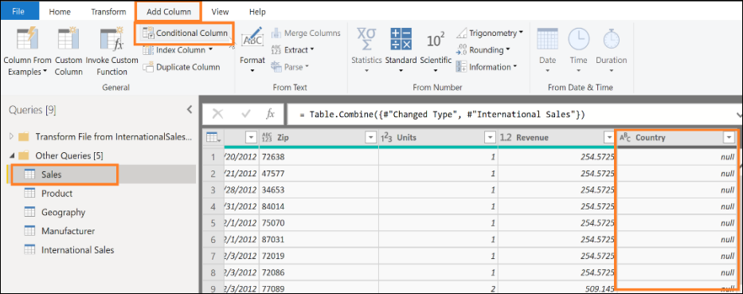
    
51. In the **Add Conditional Column** dialog box, enter the name of the column as “**CountryName**”.

52. Click **Country** from the **Column Name** drop-down menu.

53. Click **equals** from the **Operator** drop-down menu.

54. Enter **null** in the **Values** text.

55. Enter **USA** in the **Output** text.

56. Click the drop-down menu under **Else** and then click the **Select a column** option.

57. Click **Country** from the column drop-down menu.

58. Click **OK**.

    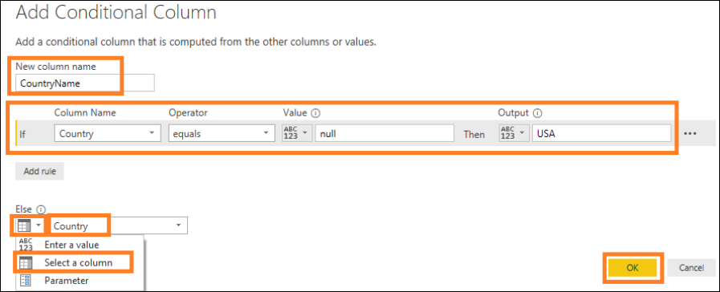
    
This reads: if current Country value equals null then the value should be USA otherwise use the current Country value

59. You will see the **CountryName** column in the Query editor window.

    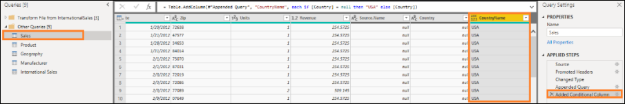
    
The original **Country** column is only required as a temporary column. It is not required in the final table for analysis and can be removed.

60. Right-click on the **Country** column and click **Remove** as shown in the figure.
 
    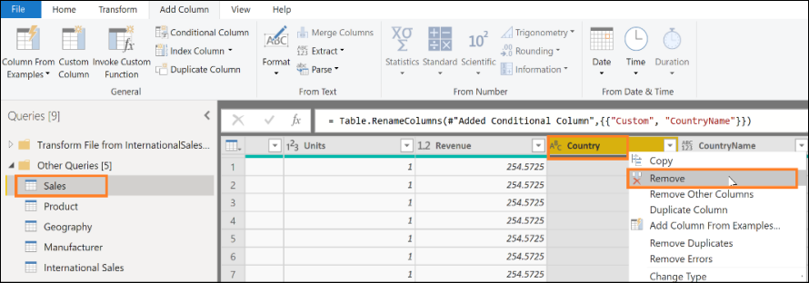
    
We can now rename the **CountryName** column to **Country**. 

61. Right-click on the **CountryName** column and rename it to **Country**.

62. Using Home then **Data Type** or by selecting the data type next to the column header, change the **data type** of the **Country** column to **Text**.

63. Using **Home** then **Data Type** or by selecting the data type next to the column header, change the **data type** of the **Revenue** column to **Fixed Decimal Number** because it is a currency field.

When the data is refreshed, it will process through all the “Applied Steps” that you have created.
 
The newly named **Country** column will have names for all countries, including the USA. You can validate this by clicking on the drop-down menu next to the **Country** column to see the unique values. 

64. At first, you will only see USA data. Click **Load more** to validate you have data from all eight countries. 

65. Click **OK** to close this filter.

    
    
Typically, when exploring data, we load a subset of data. There are multiple ways to do this. From the ribbon, you can click **Home**, click **Keep Rows**, and then click **Keep Top Rows**. Another way to load a subset of data is to navigate to **Home**, then click **Keep Rows** and then click **Keep Bottom Rows**. A third method is to click **Home**, click **Keep Rows**, and then click **Keep Range of Rows**. You can use any of these options to filter down to a subset of data.

Our dataset has data from 2014 to 2021. For our analysis we want to start with the last three years of data (2019-2021). We don’t yet know how many rows will result. We can filter by year to get the subset.

66. Click the **arrow** next to **Date** in the **Sales** Query.

67. Click **Date Filters** and then click **In the Previous…**

    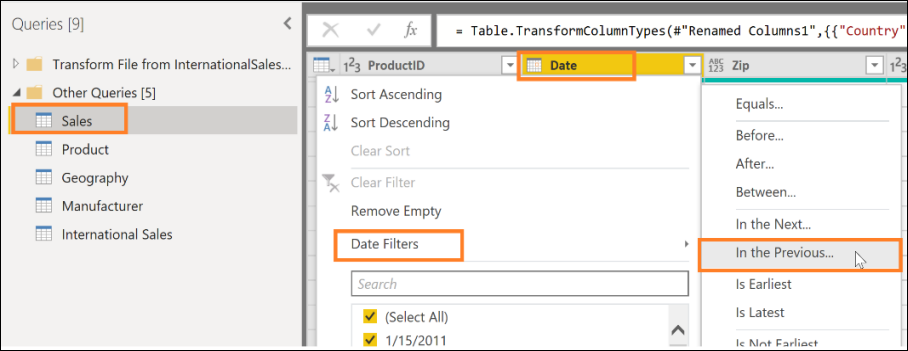
    
68. The **Filter Rows** dialog box opens. Enter **3** in the text box next to **is in the previous**.

69. Click **years** from the drop-down menu.

70. Click **OK**.

    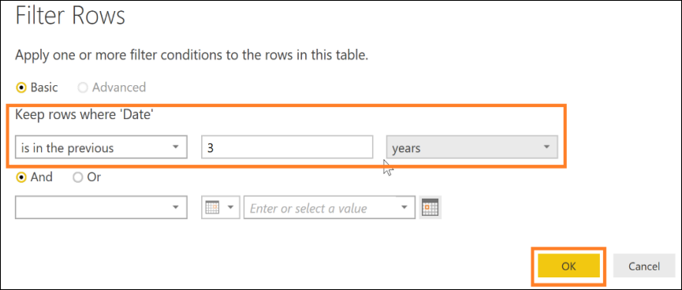
    
Now that the International Sales data is appended to the Sales query, we don’t need the International Sales table to load into the data model. Let’s prevent the International Sales table from loading into the data model. 

71. From the Queries panel on the left, click the **International Sales** query.

72. Right-click and then click **Enable Load**. This will disable loading International Sales.

    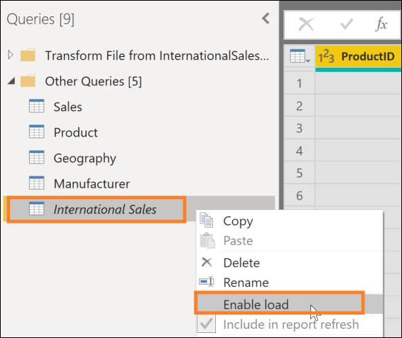
    
>**Note**: The appropriate data from the International Sales table will load into the Sales table each time the model is refreshed. By removing the International Sales table, we are preventing duplicate data from loading into the model and increasing its file size. In some instances, storing very large amounts 
of data affects the data model performance.
 
73. From the ribbon click **View** and then click **Query Dependencies**.

This opens the **Query Dependencies** dialog box. The dialog box shows the source of each query and its dependencies. For example, we see that the Sales query has a CSV file source and a dependency on the International Sales query. This is a useful information to share knowledge with your team members.

   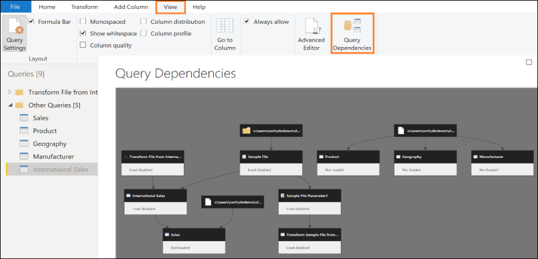

74. Click **Close** in the dialog box.

Note that you can zoom in and out of the **Query Dependencies** view as needed.

You have now successfully completed import and data shaping operations and are ready to load the data into the Power BI Desktop data model to visualize the data. 

75. Click **File** and then click **Close & Apply**. This will close out the power query window and apply all changes.

    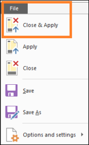
    
    All the data will be loaded in memory in the Power BI Desktop. You will see the progress dialog box with the number of rows being loaded in each table as shown in the Figure.
    
    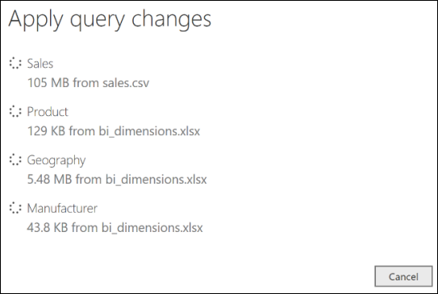
    
>**Note**: It may take several minutes to load all the tables.

76. Click **File** and then click **Save** to save the file after the data loading is complete. Name the file as “**MyFirstPowerBIModel**”. Save the file in the DIAD Reports (**\DIAD\Reports**) folder.

77. On the left panel, click **Data icon**  to view the data that was loaded. If you need to open Power Query editor, navigate to Home -> Transform Data -> Transform data.

    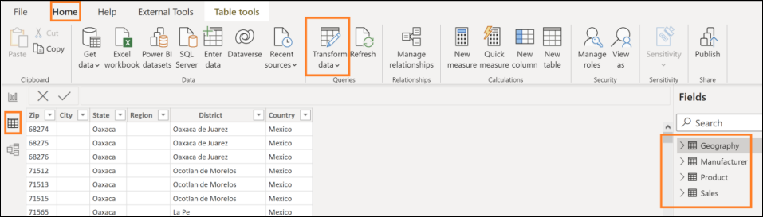
     
## References

Dashboard in a Day introduces you to some of the key functions available in Power BI. In the ribbon of the Power BI Desktop, the Help section has links to some great resources.

   

Here are a few more resources that will help you with your next steps with Power BI.

  - Getting started: http://powerbi.com
  - Power BI Desktop: https://powerbi.microsoft.com/desktop
  - Power BI Mobile: https://powerbi.microsoft.com/mobile
  - Community site https://community.powerbi.com/
  - Power BI Getting started support page: https://support.powerbi.com/knowledgebase/articles/430814-get-started-with-power-bi
  - Support site https://support.powerbi.com/
  - Feature requests https://ideas.powerbi.com/forums/265200-power-bi-ideas
  - New ideas for using Power BI https://aka.ms/PBI_Comm_Ideas
  - Power BI Courses http://aka.ms/pbi-create-reports
  - Power Platform https://powerplatform.microsoft.com/en-us/instructor-led-training/
  - Power Apps [Business Apps | Microsoft Power Apps](https://powerapps.microsoft.com/en-us/)
  - Power Automate [Power Automate | Microsoft Power Platform](https://powerapps.microsoft.com/en-us/)
  - Dataverse [What is Microsoft Dataverse? - Power Apps | Microsoft Docs](https://docs.microsoft.com/en-us/powerapps/maker/data-platform/data-platform-intro)

 
