# Lab 3 - Data Visualization

**Contents** 

<!-- TOC -->

- [Introduction](#introduction)
- [Power BI Desktop](#power-bi-desktop)
  - [Power BI Desktop – Data Visualization](#power-bi-desktop-data-visualization)
- [References](#references)

## Introduction

This document is lab three out of five total labs.

Please continue to use your file after completing Lab 2. If you are joining the DIAD at this point or were unable to complete previous labs, please start this lab with the provided **Lab 2 solution.pbix** file found in the Reports folder.

At the end of this lab, you will have completed a full report that is ready to be published to the Power BI Service. In the report, you will have learned how to do conditional formatting, add a logo to the manufacturer filter, import a custom visual, and apply a custom theme to the report. By the end of this lab, you will have also learned how to add bookmarks to tell a story about the report.

The flow of this document includes screenshots to provide a visual aid for the users and a text description of the steps the user needs to follow. In the screenshots, sections are highlighted with red or orange boxes to indicate the action or area on which a user needs to focus.

>**NOTE:** This lab uses real, anonymized data provided by ObviEnce, LLC. Visit their site to learn about their services: www.obvience.co[m](http://www.obvience.com/)[.](http://www.obvience.com/)This data is the property of ObviEnce, LLC and has been shared to demonstrate Power BI functionality with industry sample data. Any use of this data must include this attribution to ObviEnce, LLC.

## Power BI Desktop

### Power BI Desktop – Data Visualization

Now that we’ve completed data exploration and visualization in labs one and two, you have good insights to share with your team. In this section, you create a professional report for the benefit of you and your entire team.

At the end of this section, you will build a report like the one shown in the screenshot below.

  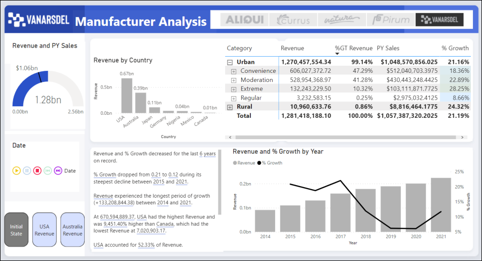

Now let’s get started, we will pick up where we left off at the end of Lab 2.

1. With the **Matrix** visual selected, navigate to the **Values** section and click the arrow next to **% Growth**.

2. Click **Conditional Formatting** and then click Background color. The **Background color** dialog box opens. This dialog provides options to format the report background color using either rules or diverging colors.

   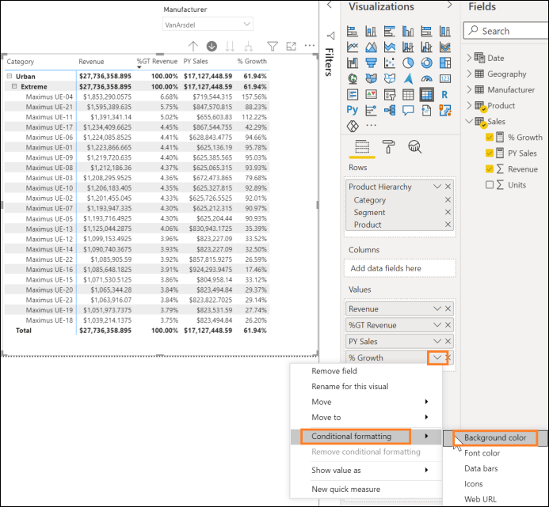

3. Click on the Add a middle color checkbox.

4. Click **OK**.

   
 
>**Note:** Conditional formatting can also be based on another column using the **Color based on** the drop-down menu.

Initially, we added a filter to load three years of data. Let’s load the complete data now.

5. From the **ribbon**, click **Home** and then click **Transform Data**. The **Power Query Editor** window opens.

6. Click the **filter** button on the **Date** column.

7. Click **Clear filter** to remove the 3-year filter.

   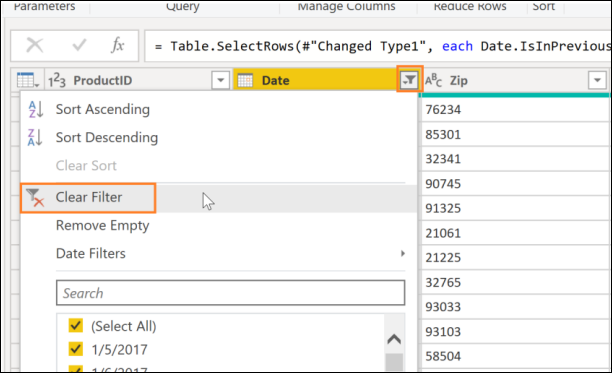

8. Click **Home** and then click **Close & Apply** to load the data.

This time all the data will be loaded. It might take a couple of minutes as we are loading approximately seven million rows.

Make sure the report is filtered by VanArsdel using the **Manufacturer** slicer. Remove all other filters.

9. Enable drill down mode on the **Revenue by Country** visual

   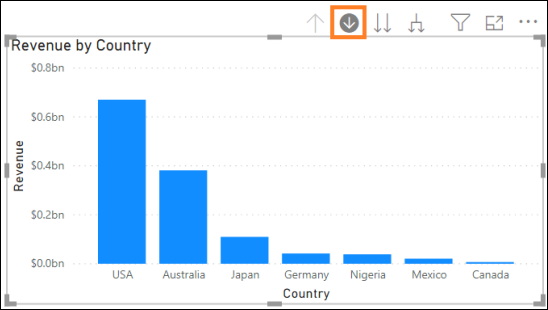

10. Click **Australia** to drill down to **State.**

11. Disable drill mode on the **Revenue by Country and State** visual

At this point, your report page should look like the screenshot below.

   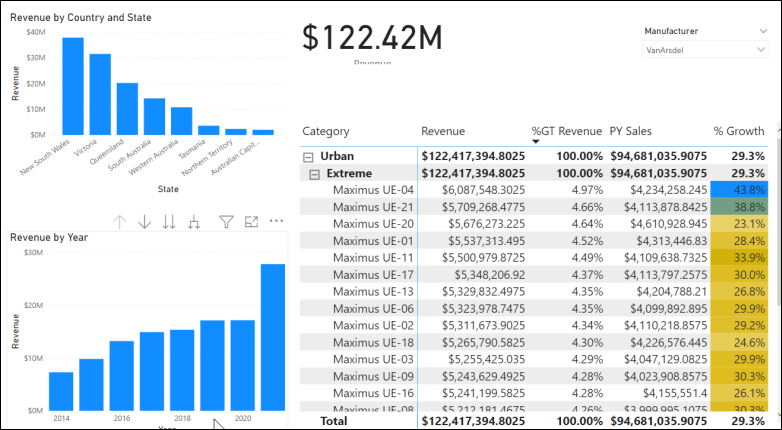

Once data is loaded, notice **Revenue by Year visual**. You will see columns for years 2014 through 2021.

12. Hover over **Manufacturer slicer** visual.

13. On the top right corner, click the **arrow**.

14. Click **List**.

    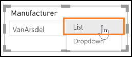

15. In the **Visualizations** panel, click the **paint roller** icon. This opens the formatting options available for a visual.

16. To expand the **General** section, click **Horizontal** in the **Orientation** drop-down menu.

17. Notice the **Slicer** visual is updated. You can resize the visual, so all the manufacturers are listed horizontally.

    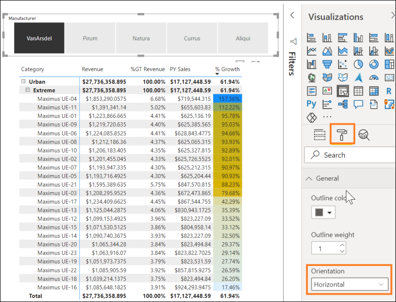

>**Note**: There are other options to change the outline color, weight, and more.

18. Click **VanArsdel**.

19. Now, collapse the **General** section.

>**Note:** Notice there is an option to enable the **Select All** option in the visual. There is also an option to make the slicer multi-select. Feel free to explore other formatting options.

Now it would be nice to add logos of the manufacturer to the slicer. Let’s do it.

20. From the **Fields** section, click the **Logo** field in the **Manufacturer** table

21. From the ribbon, click **Column** tools, click **Data Category** and then click **Image URL.** Setting the data category to **Image URL** helps Power BI understand that it is a URL so it can access the data.

    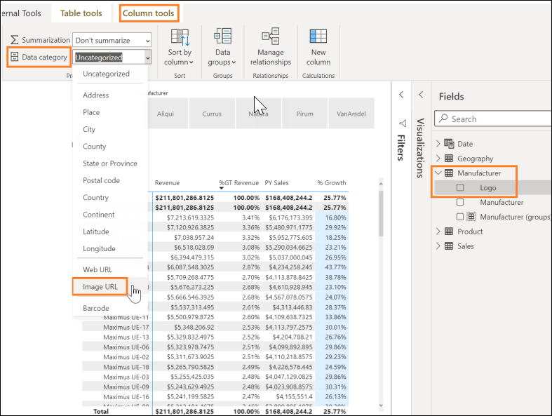

22. From the canvas, click the **Manufacturer** slicer.

23. From the **Fields** section, drag and drop the **Logo** from the **Manufacturer** table to the **Field** box replacing the **Manufacturer** column.

24. **Resize** the slicer visual as needed.

    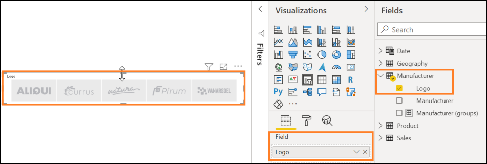

25. Click the **VanArsdel** logo to filter all the other visuals.

26. Click the **Revenue by Year** visual.

27. From **Visualizations** panel, click the **Line and clustered** column chart to change the visual type.

28. From the **Fields** section, drag and drop the **% Growth** field from the **Sales** table to the **Line values**.

    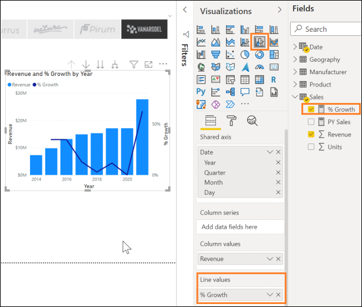

This provides a representation of the revenue and growth over time.

29. Now let’s click the **Revenue Card** visual so we can change it to a **Gauge** visual.

30. From the **Visualizations** panel, click the **Gauge** visual.

31. From the **Fields** section, drag and drop the **PY Sales** field to the **Target value**.

    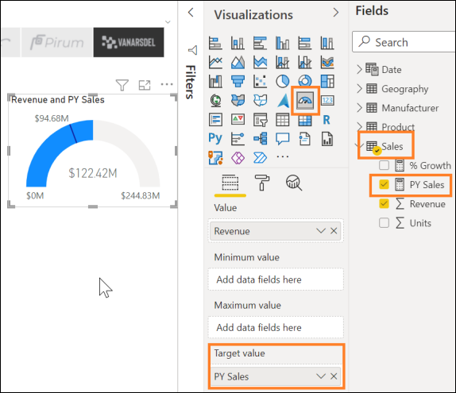

32. Resize the visual as needed. Now we can compare **Revenue** with the target.

Now let’s take time to select the colors of the visuals.

33. Click the **Gauge** visual.

34. From the **Visualizations** panel, click the **paint roller** icon.

35. Expand the **Data Colors** section.

36. Click the arrow next to **Fill** color.

37. Notice you can pick a color from the default color palette or pick More colors.

    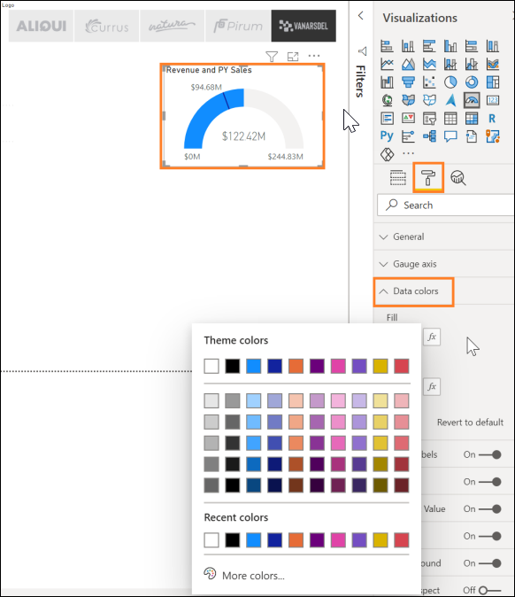

Let’s check out some of the themes available.

38. From the ribbon, click **View**, click **Themes**, and then click **Temperature**.

    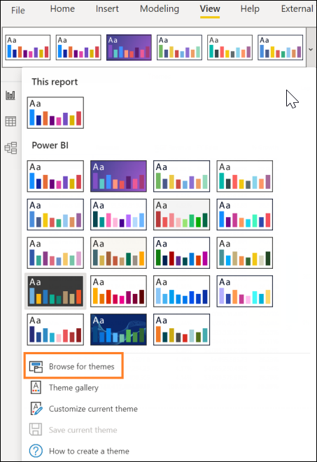

Notice that the colors on all the visuals are updated. Feel free to try the other out-of-the-box themes.

In our scenario, the Marketing department has provided standard color themes to be used across reports. We can use the **Report Theme** feature in Power BI by uploading a theme. The **Report Theme** requires a JSON file where the data colors, background, foreground, and a table of accent colors are defined. The JSON file can be used across all the reports.

39. From the ribbon, click **View**, click **Themes**, and then click **Browse for themes**.

40. A file browser dialog box opens. Navigate to the **Data** folder then the **Theme** folder (/Data/Theme).

41. Click the **DIADTheme2** file and then click **Open**.

    

42. Once the theme is imported, a success dialog box opens. Click **Close**.

    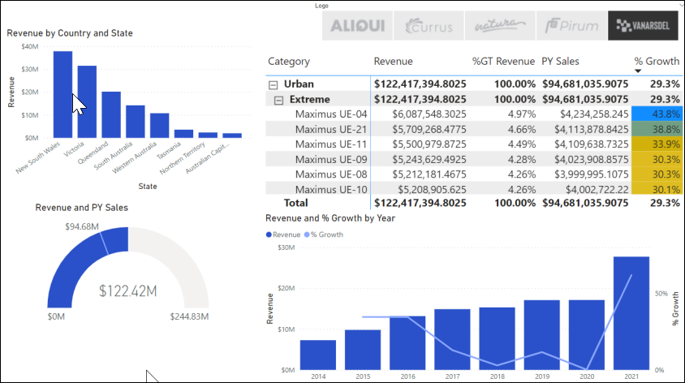

Notice colors on all the visuals are updated. Your report should look like the screenshot at this point. This theme looks good. Now, most of the visuals are blue, so let’s add some contrast.

>**Note:** Here you can save and add your custom themes.

43. Click the **Gauge** visual.

44. From the **Visualizations** panel, click the **paint roller** icon.

45. Expand the **Data colors** section.

46. Click the drop-down menu next to **Target**. Notice the color palette is different now.

47. Click the **black** color. Notice how it changes in the visual.

48. Collapse the **Data colors** section.

    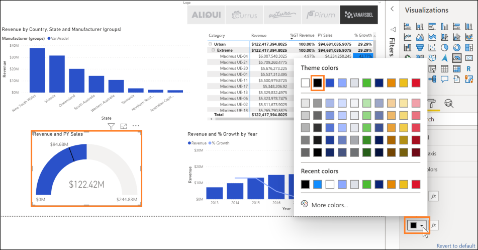

49. Expand the **Data Labels** section.

50. Change the **Text size** to **10**.

51. Expand the **Target** section.

52. Change the **Text size** to **10**.

    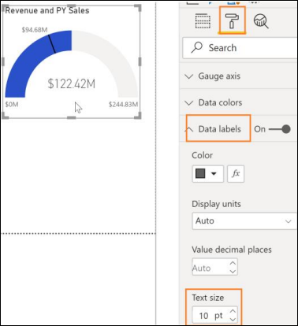

53. Click the **Matrix** visual.

54. Drill up to the **Segment** level.

55. Click the **Revenue by Country and State** visual.

56. Drill up to the **Country** level.

57. From the **Visualizations** panel, click the **paint roller** icon.

58. Expand the **Data colors** section.

59. Select a light shade of **gray** as the **Default color**.

60. Enable and expand the **Data labels**.

61. Change the **Display** units to **Millions**.

    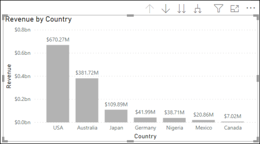

Notice that there a lot of formatting options. For example, a visual title can be changed and formatted, or you can add a border and background to the visual. Feel free to explore the options.

62. Let’s move to another visual, click the **Revenue and % Growth by Year** visual.

63. From the **Visualizations** panel, click the **paint roller** icon.

64. Expand the **Data colors** section.

65. Select the **black** color for **% Growth.**

66. Select a light shade of **gray** as the **Default color**.

    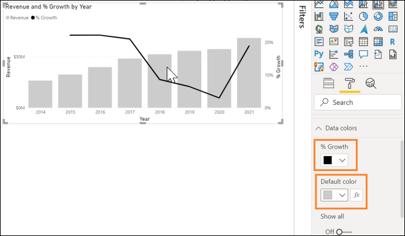

Now let’s add a report title.

67. From the ribbon, click **Home** and then click **Text box**. Notice a text box visual is added.

68. **Resize** the visual as needed.

69. Enter **Manufacturer Analysis** in the text box.

70. Highlight **Manufacturer Analysis** to format the text.

71. Select **Segoe (Bold)** as the **font**.

72. Select **36** as the **font size**.

73. Resize the text box as needed.

74. Notice the additional formatting option that have been added highlighted in black (superscript, subscript, and bulleted lists)

    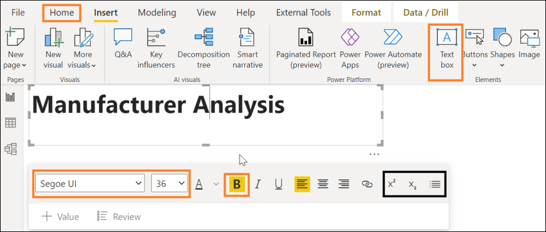

75. From the ribbon, click **View**.

76. Click the checkbox next to **Show Gridlines** and **Snap to Grid**. This will help with aligning the visuals.

    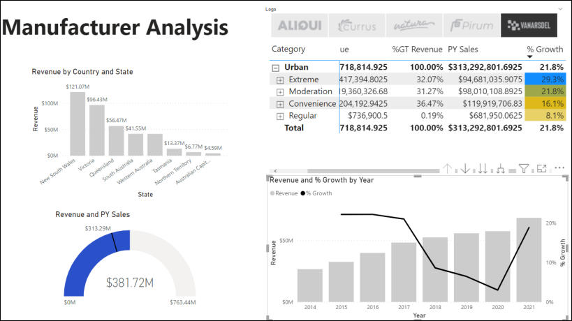

77. Uncheck the **Show Gridlines** and **Snap to Grid** options to disable these features.

78. Right-click the page name in the lower-left corner and then click **Rename Page.**

79. Rename the page to **Manufacturer**.

    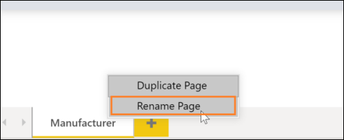

We can also use a background image to format the reports. Let’s try it.

80. Click the white space in the canvas.

81. From the **Visualizations** panel, click the **paint roller** icon.

82. Expand the **Page Background** section.

83. Click the **Add Image** button.

84. A File browser dialog box opens. Browse to the **DIAD** folder then the **Data** folder (/DIAD/Data).

85. Click the **Background** file.

86. Click **Open**.

    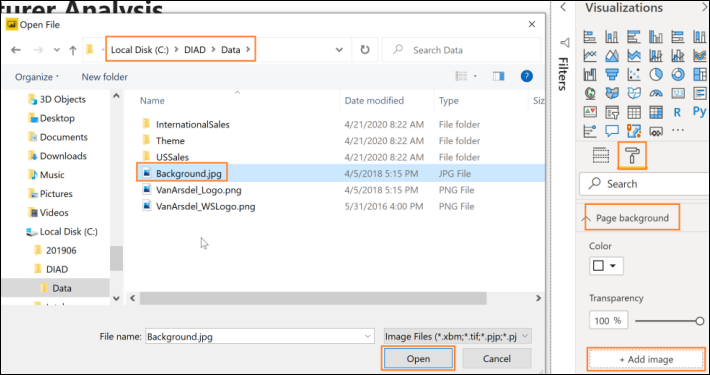

87. From **Image Fit** drop-down, click **Fit**.

88. Slide **Transparency** slider to **0%**.

    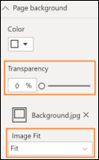

Notice we have a template which has a place for header and slots for images.

89. **Resize** and **arrange** the visuals as shown in the screenshot

    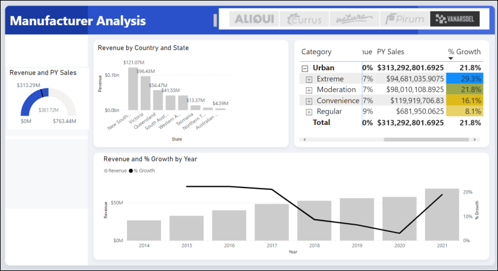

Now let’s add a logo.

90. From the ribbon, click **Insert** and then click **Image**

91. The **File browser** dialog opens. Browse to the **DIAD** folder then the **Data** folder (/DIAD/Data).

92. Change the file type to **All files(\*).**

93. Click the **VanArsdel\_Logo** file.

94. Click **Open**.

    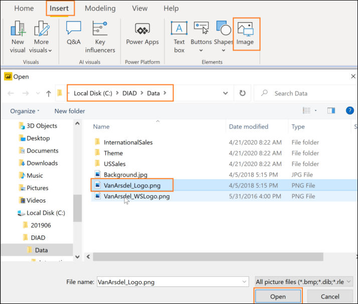

95. **Resize** the visual as needed.

96. **Drag** the visual to the top left corner of the page.

>**Note:** The logo is transparent. You need to place it on the blue background to see it.

Now let’s change the font color of the report title.

97. Highlight **Manufacturer Analysis**.

98. Click the arrow next to the **A** for the font color. Select the **white** color.

99. Change the **size** of the **font** to **24**

    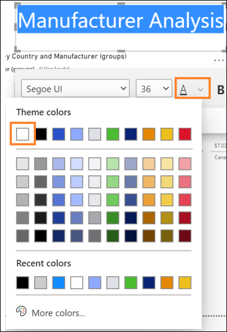

100. Click on **Background** in the **Visualizations** pane and select the blue color shown below.

     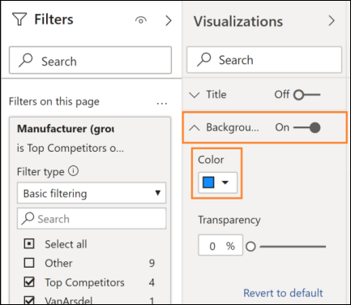

Now let’s add a smart narrative visual to our report.

101. First resize the Revenue by Year visual

     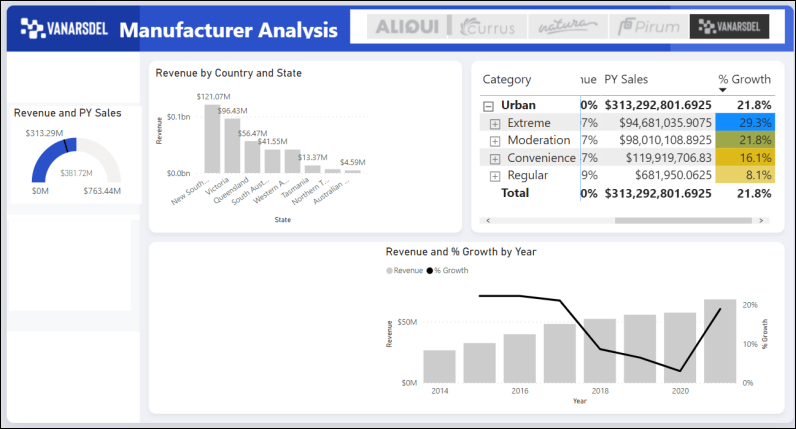

102. Add a smart narrative visual to the canvas

     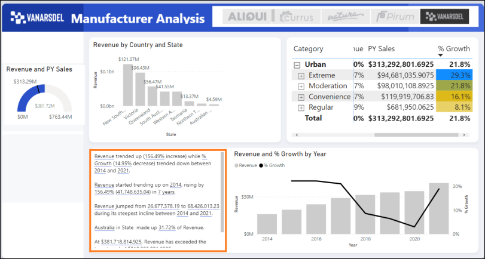

Out of the box, Power BI has a large selection of visuals. However, there may be a use-case when you need a custom visual. To meet this requirement, the visualization engine is open-sourced. The Power BI community contributes visuals in the marketplace. You can add and use these visuals in your reports.

There is also an option to create your own visual and import it into Power BI Desktop.

Now let’s add a custom visual.

103. From **Visualizations** section, click the ellipse in the last row of visuals.

104. Click **Get more visuals**.

     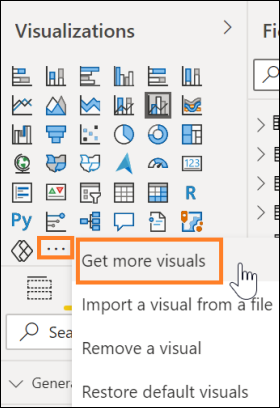

105. Type **play axis** in the **search box** and click the **Search** icon.

106. Click the **Add** next to the **Play Axis (Dynamic Slicer)**.

     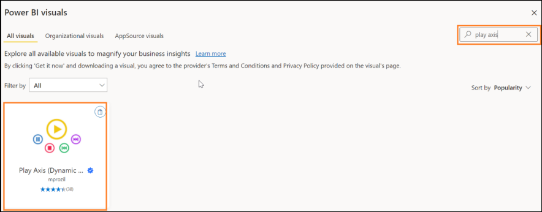

**Note**: Notice the checkmark in the blue star. This image is used to identify certified custom visuals. Custom visuals that meet Power BI teams coding requirements are certified. Certified custom visuals support features like export to PowerPoint and the ability to display in subscription emails which are not supported by non-certified custom visuals.

107. The **import custom visual** dialog opens. Click Get it now

     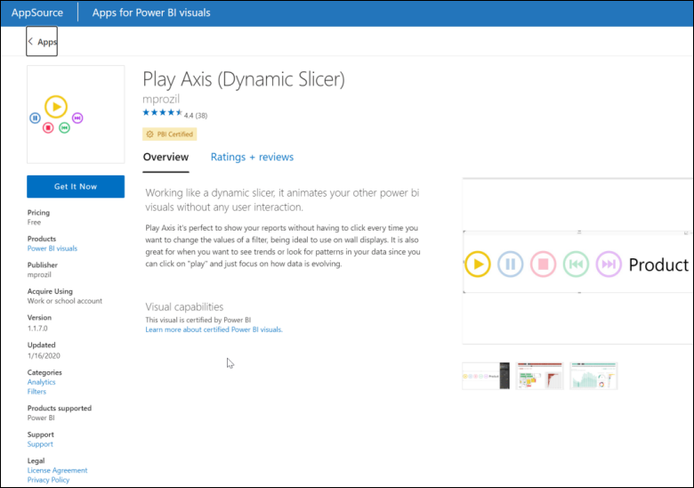

108. Notice a new visual is added to the list of available visuals.

109. Click on the white space in the canvas.

110. From the **Visualizations** section, click the newly imported **Play Axis** visual.

111. From the **Fields** section, click the checkbox next to the **Date** field in the **Date** table.

112. From the **Visualizations** panel, click the **paint roller** icon.

113. Expand the **Colors** section.

114. Enable the **Show all** option.

115. **Resize** and **position** the visual as shown in the screenshot below.

     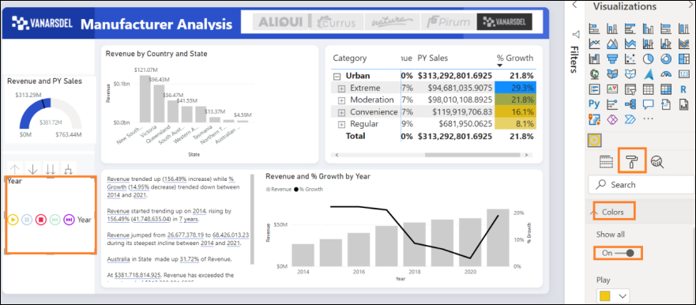

Now that we have a report ready, let’s use Bookmarks to tell the story we discovered. Bookmarks capture the currently configured view of a report page, including filtering and the state of visuals which helps to make it easier to present the story.

116. From the ribbon, click **View**.
 
117. Click the **Bookmarks** button to enable Bookmarks. The **Bookmarks** pane opens.

     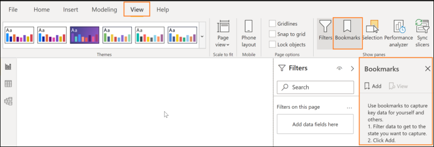

118. Click on **Add** in the **Bookmarks** pane. This will add the current state of the visual to the bookmark.

119. Click the **ellipse** next to the newly created **Bookmark 1**.

120. Click **Rename** and change the name to **Initial State**.

121. In the **Revenue by Country** visual, click the **USA** column.

122. Hover over the **Revenue by Country** visual and click the **ellipse** on the top right corner.

123. Click **Spotlight**.

124. In the **Bookmarks** pane, click **Add**. This will add a new bookmark with the current state of the report.

125. Change the bookmark name to **USA Revenue**

     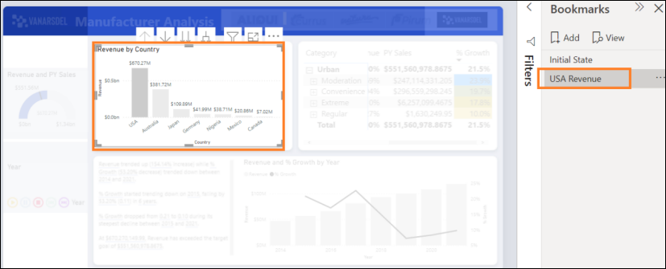

126. Click on the canvas.

127. Click **Australia** in the **Revenue by Country** visual.

128. In the **Bookmarks** pane, click **Add**. This will add a new bookmark with the current state of the report.

129. Change the bookmark name to **Australia Revenue**

     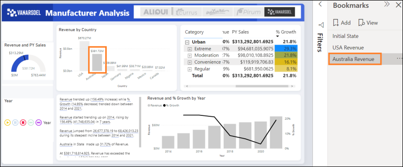

130. From the **Bookmarks** pane, click **View**. You are now in Bookmarks slide show mode. You will be in the first bookmark, which we called **Initial State**. Notice on the bottom of the report pane there is an option to navigate between bookmarks.

131. You can use the arrows to navigate between bookmarks and tell your story.

     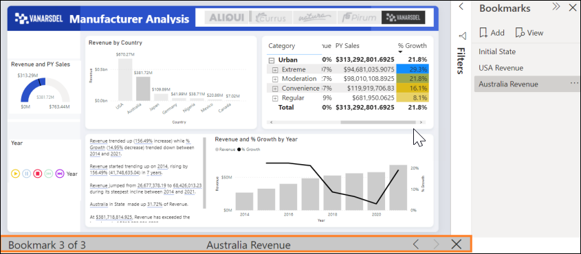

132. From the **Bookmarks** pane, click **Exit** to exit the Bookmarks slide show mode.

If time permits, feel free to explore other options available with Bookmarks, such as **Selected Visuals**, as you continue to build your story.

133. From the ribbon, click **View**.

134. Uncheck the **Bookmarks Pane**.

135. Collapse the **Visualizations** and **Filters** pane by clicking on the arrows

Now let’s add bookmark navigator buttons to the canvas

1. From the ribbon, click the **Insert** ribbon.

2. Click on **Button** and select **Navigator** -> **Bookmark navigator**

   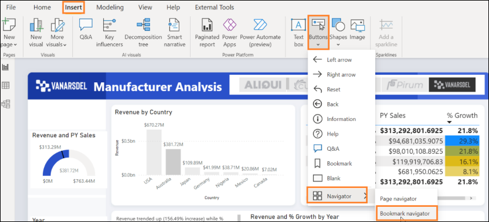

3. Arrange the Bookmark navigator to fit on the page as shown below

   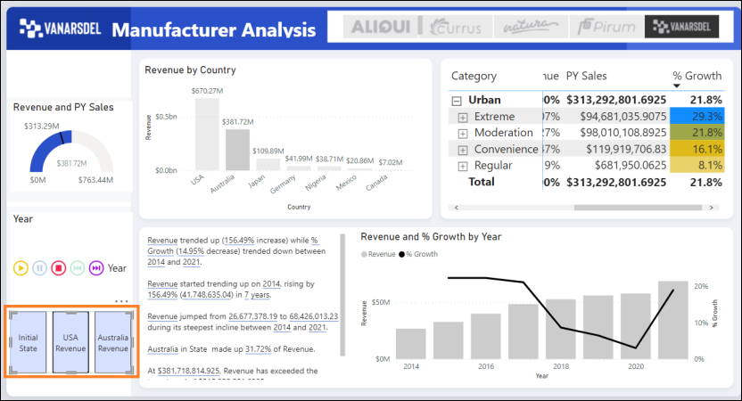

4. Click on the heading Fill and change the Fill color to a light blue and set Transparency to 40

   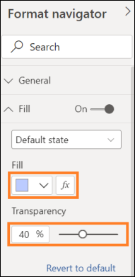

5. Click on the heading **Shape**, there is a long list of shapes to choose from, let’s pick **Rounded Rectangle**

   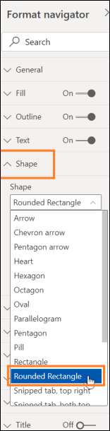

Feel free to test out the new functionality.

Your report should look as shown in the figure below. Now let’s finish up by saving the file.

  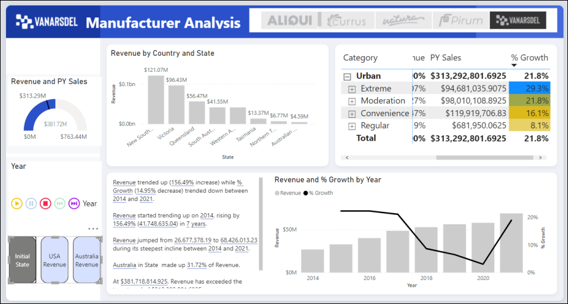

6. Click **File** and then click **Save**.

You have built your first report!

You have successfully completed the hands-on lab by creating a report to share to your team. The nextlab covers creating a dashboard from this report to share with your team. You have seen an overview of the functionality in Power BI Desktop. There are many more features for you to explore with your data!

## References

Dashboard in a Day introduces you to some of the key functions available in Power BI. In the ribbon of the Power BI Desktop, the Help section has links to some great resources.

   

Here are a few more resources that will help you with your next steps with Power BI.

  - Getting started: http://powerbi.com
  - Power BI Desktop: https://powerbi.microsoft.com/desktop
  - Power BI Mobile: https://powerbi.microsoft.com/mobile
  - Community site https://community.powerbi.com/
  - Power BI Getting started support page: https://support.powerbi.com/knowledgebase/articles/430814-get-started-with-power-bi
  - Support site https://support.powerbi.com/
  - Feature requests https://ideas.powerbi.com/forums/265200-power-bi-ideas
  - New ideas for using Power BI https://aka.ms/PBI_Comm_Ideas
  - Power BI Courses http://aka.ms/pbi-create-reports
  - Power Platform https://powerplatform.microsoft.com/en-us/instructor-led-training/
  - Power Apps [Business Apps | Microsoft Power Apps](https://powerapps.microsoft.com/en-us/)
  - Power Automate [Power Automate | Microsoft Power Platform](https://powerapps.microsoft.com/en-us/)
  - Dataverse [What is Microsoft Dataverse? - Power Apps | Microsoft Docs](https://docs.microsoft.com/en-us/powerapps/maker/data-platform/data-platform-intro)

