# Lab 5 - Collaboration

**Contents** 

<!-- TOC -->

- [Introduction](#introduction)
- [Power BI Service – Collaboration and Distribution](#power-bi-service-collaboration-and-distribution)
- [Power BI Mobile – Accessing Report on Mobile Device](#power-bi-mobile-accessing-report-on-mobile-device)
- [References](#references)

## Introduction

This document is lab five of five total labs.

Please continue to use your file after completing Lab 4. If you are joining the DIAD at this point or were unable to complete previous labs, please start this lab with the provided **DIAD Final Report.pbix** file located in the Reports folder.

At the end of this lab, you will have learned how to share your dashboard and collaborate with other users. You will also have learned how to access your dashboard on your mobile device.

The lab includes steps for the user to follow along together with associated screenshots that provide a visual aid. In the screenshots, sections are highlighted with red or orange boxes to indicate the area the user needs to focus on.

>**NOTE:** This lab uses real, anonymid data provided by ObviEnce, LLC. Visit their site to learn about their services: www.obvience.com. This data is the property of ObviEnce, LLC and has been shared to demonstrate Power BI functionality with industry sample data. Any use of this data must include this attribution to ObviEnce, LLC.

## Power BI Service -- Collaboration and Distribution

You have built the dashboard and are now ready to get feedback and collaborate with your team members.

1. Sign in to PowerBI.com to access your workspace.

2. From the left panel, click **Workspaces**.

3. Click the **ellipsis** next to **DIAD\_\<youremailaddress\>.**

4. Click **Workspace access**.

5. The **Access** dialog opens. Enter the email addresses of the colleagues with whom you want to collaborate. Each user can belong to one of three roles as follows:
  
 
  |  Contributor  | Add/edit/delete content within workspace. |
  | ------------- | ------------- |
  
  |  Member       | Everything a Contributor can do. Re-share. Publish & update Apps.          | 
  | ------------- | ------------- |
  
  |  Admin        | Everything a member can do. Can change/delete workspace. Can add Admins.     |           
  | ------------- | ------------- |
  
  |  Viewer       | View/interact. Read data stored in workplace Data Flows  |
  | ------------- | ------------- |

 6. Select the appropriate role and then click **Add**.

 7. Once you have finished adding your colleagues, click **Close**.

>**Note**: If you don't have a colleague's email please close without submission.

>**Note**: You can ask your colleague to login and access the workspace.

   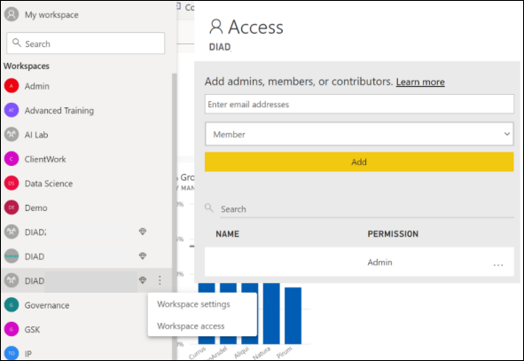

Now let's share the content we have created with report viewers and consumers. To start, we need to publish an app. An App can include multiple dashboards and reports.

1. In the left panel select the **DIAD\_\<youremailaddress\>workspace**.

2. In the **Dashboard** page, notice there is an option named **Included in App** which can be selected to include the Dashboard in the App.
 
   
 
3. Navigate to the **Reports** page.

4. Notice there is an option named **Included in App** which can be selected to include the Reports in the App.

If you have reports and dashboards in your workspace that you do not want to share with report viewers, uncheck this box. In our case we would like to include the DIAD Final Report, so we will leave the box
checked. Ensure you have checked the report and not the dataset.

   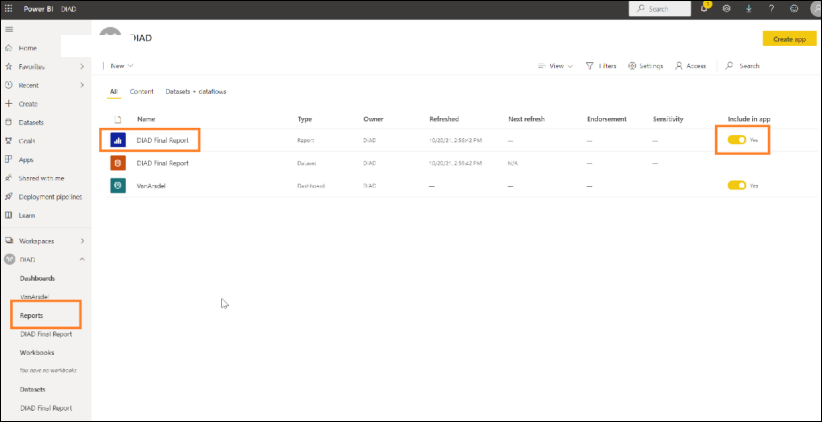

5. In the left panel, click the **DIAD\_\<youremailaddress\>** workspace.

6. In the upper right corner, click the **Create app** button.

   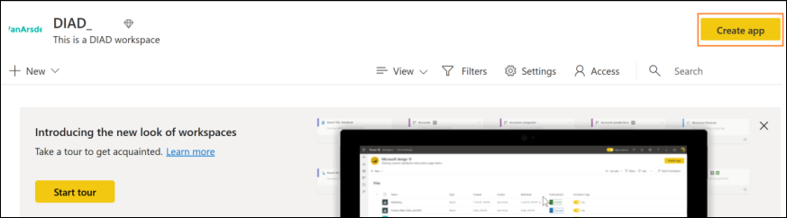

7. In the **Setup** page, name the app and type **This is a DIAD app** in the description field.  

   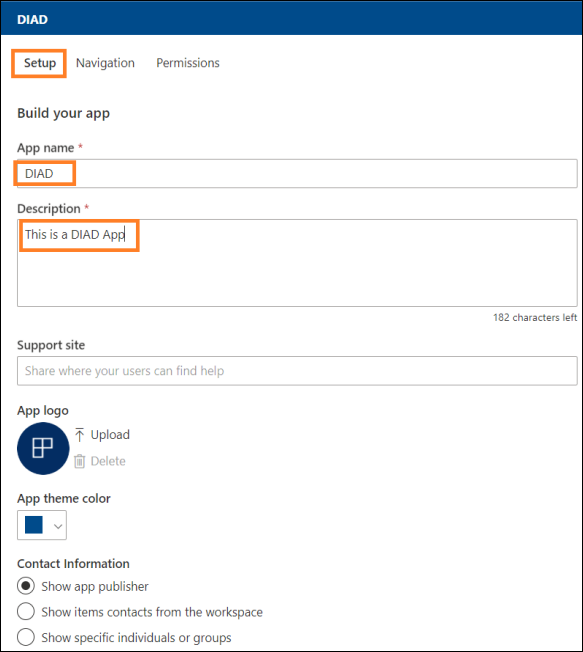

8. Click the **Navigation** tab.

9. From the **Navigation** menu, click **VanArsdel (dashboard)**.

   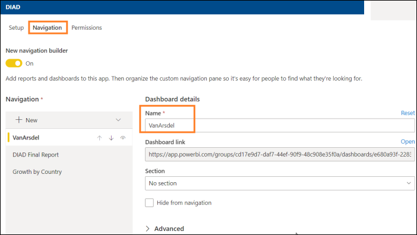

10. When a user accesses the DIAD app, we want them to land on the **VanArsdel** dashboard. 

11. Navigate to the **Permissions** page.

    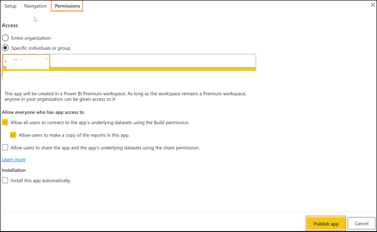

12. Enter the email addresses of the users or groups to whom you want to give access. 

>**Note**: If you didn't enter an email address previously, no need to enter one here. 

13. On the bottom right corner, click **Publish App**.

14. The **Ready to publish** dialog appears, click **Publish**.

15. Once the App is published a success dialog appears.

    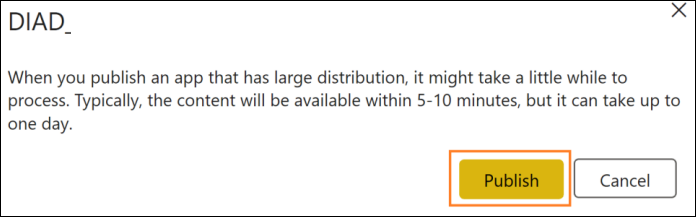

You can copy the link to the App after it's been successfully published and share it with individuals via email. A better way for report viewers to consume the App is by logging onto Power BI Service and registering the App. Let's impersonate a report viewer:

1. From the left menu, click **Apps**.

2. Click **Get apps**.  

   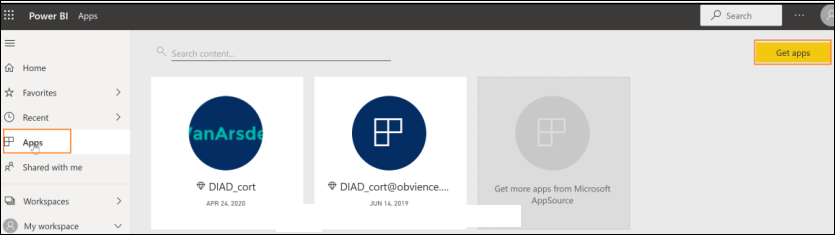

3.The **AppSource** dialog opens. You will notice the **DIAD\_\<youremailaddress\>** app is listed. Select the newly added app.

This is a one-time registration. Going forward when you select **Apps** in the left panel, you will see the **DIAD\_\<youremailaddress\>** app in the list of Apps you have registered, and then you can click **Get it now.**

   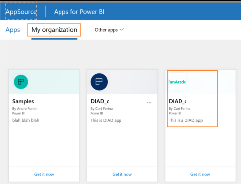

## Power BI Mobile -- Accessing Report on Mobile Device 

1. Open the Power BI Mobile app on your mobile device
 
   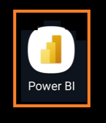

2. Click **Get Started** after the app is open.

   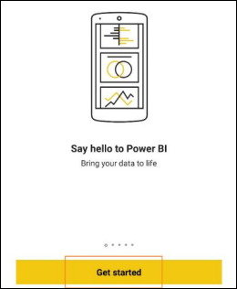

3. Click **Power BI** to connect to your report.

   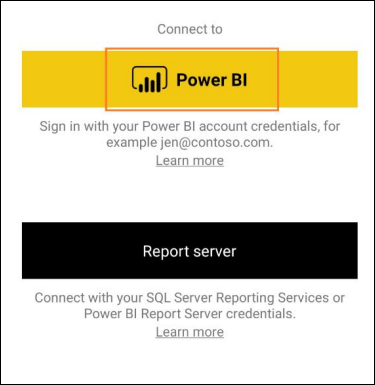
 
4. Click **Sign in** and enter your credentials.

   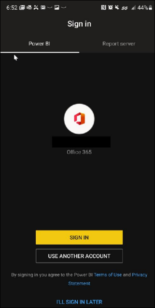

5. Verify you have successfully signed in and then click **Start exploring**.

   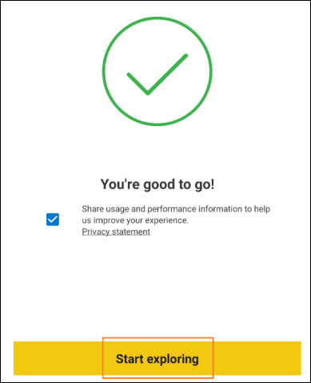

6. Click the **DIAD Final Report** that you published from Power BI Desktop.

   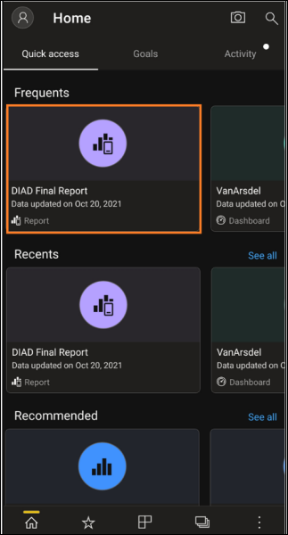

7. Verify that you see the mobile view you published from Power BI Desktop.

   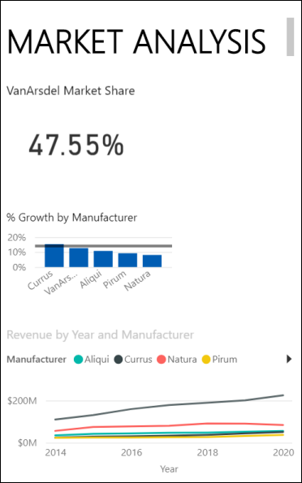
  
### Further Exploration -- Power Platform

   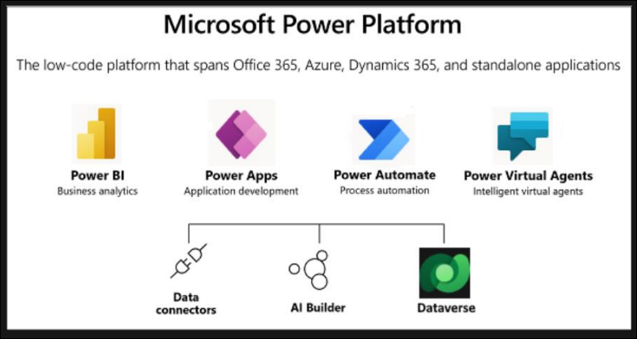

### Power Apps

[Microsoft Power Apps documentation - Power Apps | Microsoft Docs](https://docs.microsoft.com/en-us/powerapps/)

Suite of apps, services, and connectors, as well as a data platform, that provides rapid development environment to build custom apps for your business needs

Quickly build custom business apps that connect to your data stored either in the underlying data platform (Microsoft Dataverse) or in various online and on-premises data sources.

   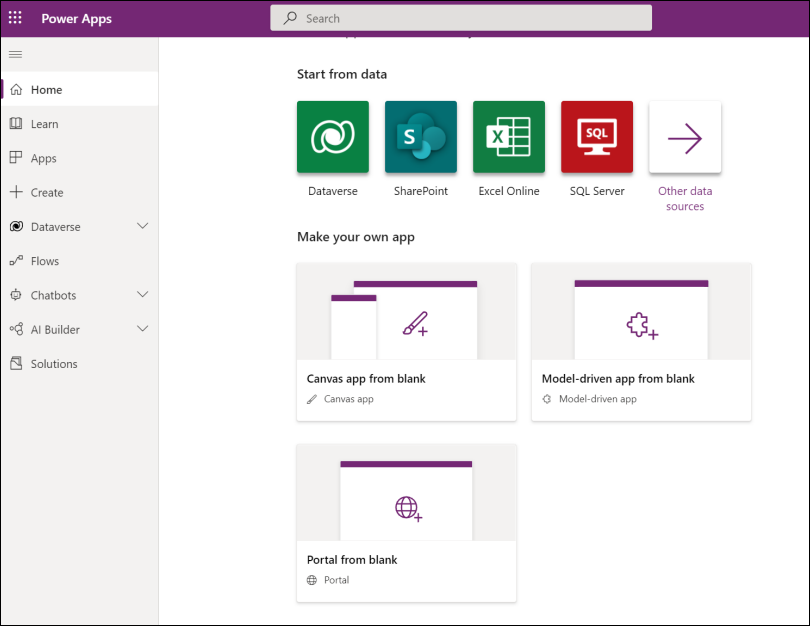

Additional Power Apps training

https://powerapps.microsoft.com/en-us/blog/free-app-in-a-day-powerapps-training-and-more-frompragmatic-works/

[Microsoft Power Platform: Learning Resources | Microsoft Power Apps](https://powerapps.microsoft.com/en-us/blog/microsoft-powerapps-learning-resources/)

### Power Automate

https://docs.microsoft.com/en-us/power-automate/getting-started

What can I do with Power Automate?

-  Automate business processes
-  Send automatic reminders for past due tasks
-  Move business data between systems on a schedule
- Connect to almost 300 data sources or any publicly available API
- You can even automate tasks on your local computer like computing data in Excel

   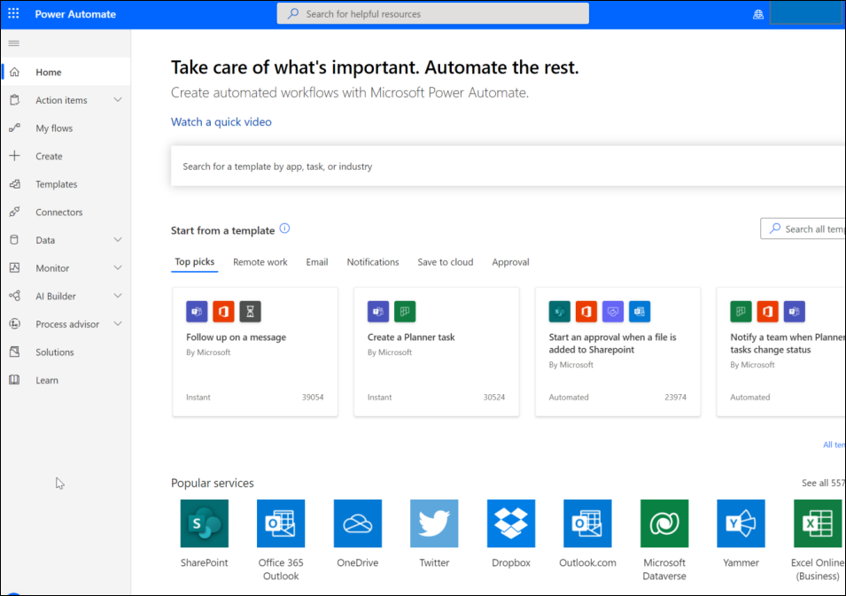

Additional Power Automate training

[Power Automate on Microsoft Learn | Microsoft Docs](https://docs.microsoft.com/en-us/learn/powerplatform/power-automate)

### Dataverse

[What is Microsoft Dataverse? - Power Apps | Microsoft Docs](https://docs.microsoft.com/en-us/powerapps/maker/data-platform/data-platform-intro)

Dataverse lets you securely store and manage data that’s used by business applications. Dataverse allows data to be integrated from multiple sources into a single store, w hich can then be used in Power Apps, Power Automate, Power BI, and Power Virtual Agents along with data that’s already available from the Dynamic 365 applications.

Why use Dataverse?

- Easy to manage
- Easy to secure
- Access your Dynamics 365 data
- Rich metadata
- Logic and validation
- Productivity tools

 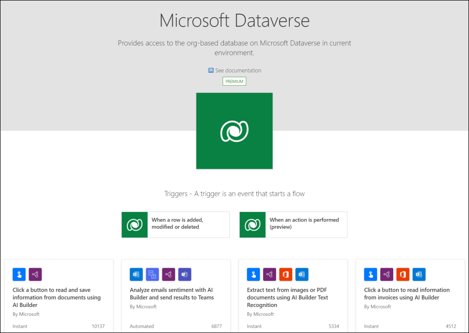

Additional Dataverse training

[Get started using Microsoft Dataverse - Learn | Microsoft Docs](https://docs.microsoft.com/en-us/learn/paths/get-started-cds/)

## References

Dashboard in a Day introduces you to some of the key functions available in Power BI. In the ribbon of the Power BI Desktop, the Help section has links to some great resources.

   

Here are a few more resources that will help you with your next steps with Power BI.

  - Getting started: http://powerbi.com
  - Power BI Desktop: https://powerbi.microsoft.com/desktop
  - Power BI Mobile: https://powerbi.microsoft.com/mobile
  - Community site https://community.powerbi.com/
  - Power BI Getting started support page: https://support.powerbi.com/knowledgebase/articles/430814-get-started-with-power-bi
  - Support site https://support.powerbi.com/
  - Feature requests https://ideas.powerbi.com/forums/265200-power-bi-ideas
  - New ideas for using Power BI https://aka.ms/PBI_Comm_Ideas
  - Power BI Courses http://aka.ms/pbi-create-reports
  - Power Platform https://powerplatform.microsoft.com/en-us/instructor-led-training/
  - Power Apps [Business Apps | Microsoft Power Apps](https://powerapps.microsoft.com/en-us/)
  - Power Automate [Power Automate | Microsoft Power Platform](https://powerapps.microsoft.com/en-us/)
  - Dataverse [What is Microsoft Dataverse? - Power Apps | Microsoft Docs](https://docs.microsoft.com/en-us/powerapps/maker/data-platform/data-platform-intro)

 

 
  
  
  
  
  
  
  
