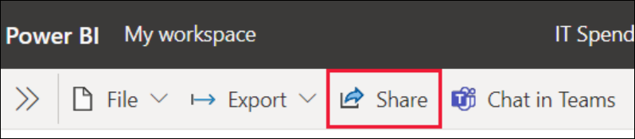
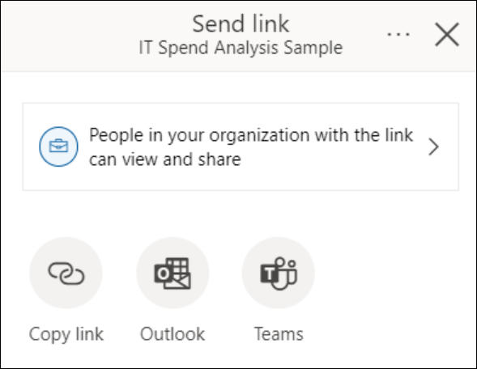
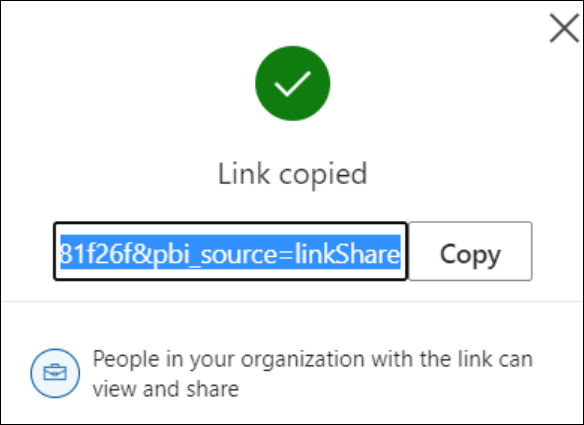
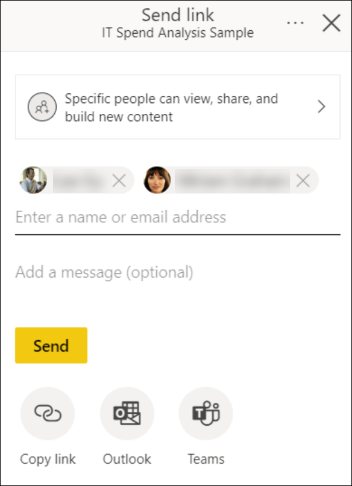
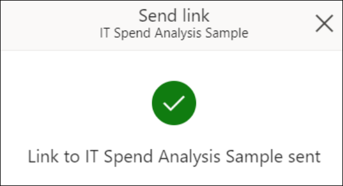
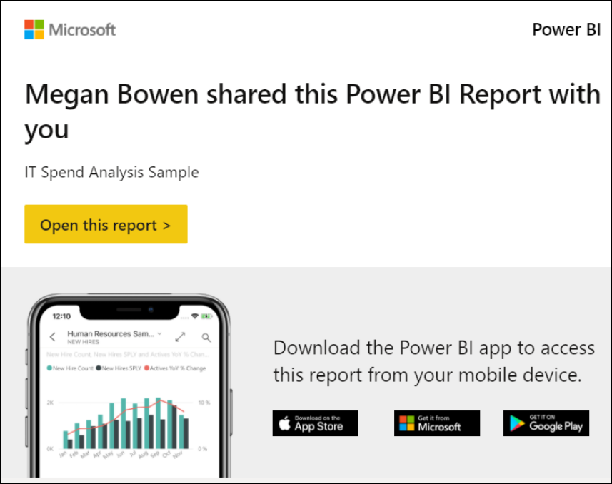

# Lab 6 - Share Power BI App in your Organization

**Contents** 

<!-- TOC -->

- [Introduction](#introduction)
- [Power BI – Share a Report](#power-bi-share-a-report)
  - [Power BI – Link settings](#power-bi-link-settings)
  - [Power BI – Manage permissions to a Report](#power-bi-manage-permissions-to-a-report)
- [Power BI – Share a dashboard](#power-bi-share-a-dashboard)
  - [Power BI – Manage permissions to a Dashboard](#power-bi-manage-permissions-to-a-dashboard)
- [References](#references)

## Introduction

**Sharing** is the easiest way to give people access to your reports and dashboards in the Power BI service. You can share with people inside or outside your organization.

When you share a report or dashboard, the people you share it with can view it and interact with it but can't edit it. They see the same data that you see in the reports and dashboards and get access to the entire underlying dataset unless row-level security (RLS) is applied to the underlying dataset. The coworkers you share with can reshare with their coworkers if you allow them to.

   

The Power BI service offers other ways to collaborate and distribute reports and dashboards, too. Read [Ways to collaborate and share in Power BI](https://docs.microsoft.com/en-us/power-bi/collaborate-share/service-how-to-collaborate-distribute-dashboards-reports) to see which way works best for your circumstances.

Where you can share:

- You can share reports and dashboards from My Workspace.
- You can share from workspaces other than My Workspace, if you have the Admin or Member role in the workspace. If you have the Contributor or Viewer role, you can share if you have Reshare permissions.
- You can share from the Power BI mobile apps.
- You can't share directly from Power BI Desktop. You publish reports from Power BI Desktop to the Power BI service.

## Share a Report

1. In a list of reports, or in an open report, select **Share**  .

2. Then in the **Send link** dialog, you'll see the option to copy the sharing link or share it via Outlook and Teams to **People in your organization**

   

>**Note**: Your organization may not allow you to create shareable links to **People in your organization**. Learn more about this **tenant setting** in the admin portal documentation.

3. Selecting **Copy link** will automatically generate and copy a shareable link to your clipboard.

   

4. You can also choose to directly send the link to **Specific people** or groups (distribution groups or security groups). Just enter their name or email address, optionally type a message, and select **Send**.

   

5. After you select **Send**, Power BI sends the link via email to your recipients.

   

6. When your recipients receive the email, they can select **Open this report** and automatically get access to the report through the shareable link.

   

### Power BI – Link settings

